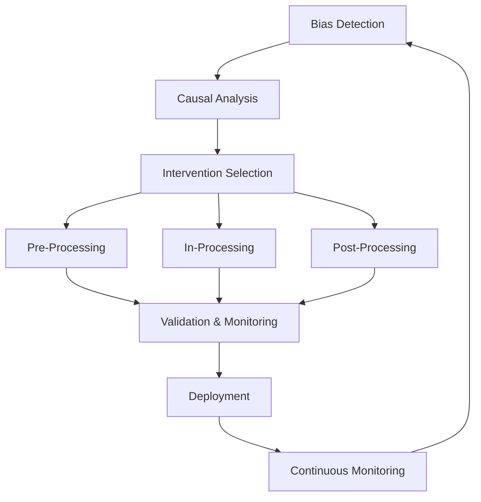
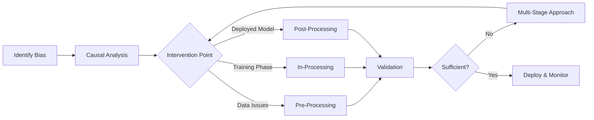

# Fairness Intervention Playbook

> A comprehensive framework for implementing fairness interventions across the ML pipeline

## 🎯 Overview

The Fairness Intervention Playbook is a systematic framework designed to help engineering teams implement fairness interventions across AI systems. It provides standardized workflows that integrate causal analysis, data transformations, model constraints, and threshold adjustments into coherent intervention strategies.

## 📋 Problem Statement

Organizations struggle with fairness interventions due to:
- **Inconsistent approaches** across different teams and projects
- **Lack of standardized workflows** connecting different intervention types
- **Limited guidance** on when and how to apply specific techniques
- **Insufficient integration** between causal analysis and technical solutions
- **Missing intersectional perspectives** in fairness assessments

## 🏗️ Playbook Architecture

## 📚 Components

### 1. [Causal Fairness Toolkit](./causal_fairness_toolkit.md)
- Identify bias sources through causal analysis
- Map relationships between protected attributes and outcomes
- Determine appropriate intervention points

### 2. [Pre-Processing Fairness Toolkit](./preprocessing_toolkit.md)
- Transform data before model training
- Apply statistical parity and sampling techniques
- Generate fair representations

### 3. [In-Processing Fairness Toolkit](./in_processing_toolkit.md) 
- Embed fairness constraints during model training
- Implement adversarial debiasing techniques
- Apply fairness regularization
- Use multi-objective optimization for trade-offs

### 4. [Post-Processing Fairness Toolkit](./post_processing_toolkit.md) 
- Adjust model outputs for fairness
- Optimize decision thresholds
- Apply calibration across groups
- Transform predictions while preserving utility

### 5. [Validation Framework](./validation_framework.md)
- Measure intervention effectiveness
- Evaluate fairness improvements
- Assess business impact
- Monitor long-term outcomes

### 6. [Comprehensive Case Study](./case_study.md) 
- End-to-end loan approval system fairness intervention
- Demonstrates integration of all four toolkits
- Shows real-world trade-offs and decisions

## 🎯 Target Audience

- **Staff Engineers** implementing fairness solutions
- **ML Engineers** building fair AI systems
- **Product Teams** ensuring equitable outcomes
- **Compliance Teams** meeting regulatory requirements
- **Engineering Managers** overseeing fairness initiatives

## ⚡ Quick Start

1. **Assess your situation** using the **Decision Tree**
2. **Start with causal analysis** in the [Causal Fairness Toolkit](./causal_fairness_toolkit.md)
3. **Choose intervention stage** based on your constraints:
   - Data issues → [Pre-Processing](./preprocessing_fairness_toolkit.md)
   - Training phase → [In-Processing](./in_processing_toolkit.md)
   - Deployed model → [Post-Processing](./post_processing_toolkit.md)
4. **Validate results** using the [Validation Framework](./validation_framework.md)

## 🔄 Workflow Overview

## 🌟 Key Features

### Intersectional Fairness
Every component explicitly addresses intersectional bias, not just single-attribute fairness.

### Practical Trade-offs
Guides help balance fairness improvements with business requirements and technical constraints.

### Modular Design
Use individual toolkits independently or combine them for comprehensive interventions.

### Real-world Focus
Based on actual implementation challenges in production ML systems.

## 📊 Success Metrics

Track your intervention success with:
- **Fairness Metrics**: Demographic parity, equal opportunity, equalized odds
- **Performance Metrics**: Accuracy, precision, recall, business KPIs
- **Implementation Metrics**: Time to deploy, resource usage, maintainability
- **Long-term Metrics**: Sustained fairness, stakeholder satisfaction

## 🔗 Navigation

**Next:** [Implementation Guide](./implementation_guide.md)

---

*Built with ❤️ for fair AI systems*
