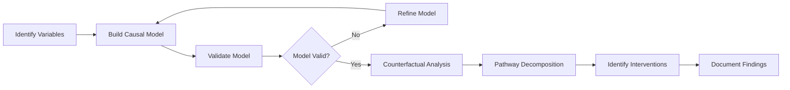

# 🔍 Causal Fairness Toolkit
> Identifying Root Causes of Bias Through Causal Analysis

## 🎯 Overview

The Causal Fairness Toolkit helps identify the mechanisms through which bias operates in your AI system. Rather than just detecting statistical disparities, it uncovers the causal pathways that create unfair outcomes, enabling targeted interventions.

## 📋 When to Use This Toolkit

- **Statistical fairness metrics** indicate bias but don't explain why
- You need to **distinguish legitimate predictive relationships** from discriminatory patterns
- **Multiple interventions have failed** because root causes weren't addressed
- **Stakeholders require explanations** for bias and intervention strategies
- **Legal compliance** requires understanding discrimination mechanisms

## 🏗️ Core Components

### Component 1: 🔎 Discrimination Mechanism Identification

#### Purpose
Systematically identify how bias enters your system through different causal pathways.

#### Framework

##### Step 1: Variable Classification
Use this template to classify all variables in your system:

```python
# Variable Classification Template
variable_types = {
    'protected_attributes': ['gender', 'race', 'age', 'religion'],
    'outcomes': ['loan_approval', 'hiring_decision', 'risk_score'],
    'mediators': ['income', 'education', 'employment_history'],
    'proxies': ['zip_code', 'name', 'school_prestige'],
    'legitimate_predictors': ['credit_score', 'debt_ratio', 'experience'],
    'confounders': ['family_background', 'economic_conditions']
}
```

##### Step 2: Pathway Identification
Identify the three types of discrimination pathways:

| Pathway Type | Description | Example | Intervention Focus |
|--------------|-------------|---------|-------------------|
| **Direct** | Protected attribute → Outcome | Gender → Hiring Decision | Remove attribute or add constraints |
| **Indirect** | Protected Attribute → Mediator → Outcome | Race → Education → Employment | Careful mediator handling |
| **Proxy** | Proxy Variable ← Confounder → Protected Attribute<br/>Proxy Variable → Outcome | Zip Code ← Segregation → Race<br/>Zip Code → Loan Approval | Transform or remove proxy |

##### Step 3: Pathway Documentation
For each identified pathway, document:
- **Causal mechanism**: How the bias flows
- **Evidence strength**: Statistical support for the relationship
- **Ethical assessment**: Whether the pathway is problematic
- **Intervention priority**: Based on harm potential and feasibility

#### Implementation Template

```python
class DiscriminationPathway:
    def __init__(self, source, target, pathway_type, mediators=None):
        self.source = source  # Protected attribute
        self.target = target  # Outcome
        self.type = pathway_type  # 'direct', 'indirect', 'proxy'
        self.mediators = mediators or []
        self.evidence_strength = None
        self.ethical_assessment = None
        self.intervention_priority = None
    
    def document_pathway(self, evidence, ethics_score, priority):
        self.evidence_strength = evidence
        self.ethical_assessment = ethics_score
        self.intervention_priority = priority
```

### Component 2: 📊 Causal Model Construction

#### Purpose
Build formal causal models that represent how discrimination operates in your domain.

#### Methodology

##### Step 1: Build Directed Acyclic Graph (DAG)
1. **Node Creation**: Add all relevant variables
2. **Edge Assignment**: Draw arrows representing causal relationships
3. **Validation**: Check with domain experts and conditional independence tests

##### Step 2: Structural Equation Modeling (SEM)
Translate your DAG into mathematical equations:

```python
# Example SEM for employment discrimination
def build_employment_sem():
    equations = {
        'education': f_education(gender, family_background, noise1),
        'experience': f_experience(gender, education, career_gaps, noise2),
        'interview_score': f_interview(gender, education, experience, bias, noise3),
        'hiring_decision': f_hiring(interview_score, education, experience, noise4)
    }
    return equations
```

##### Step 3: Model Validation
- **Conditional Independence Tests**: Verify d-separation implications
- **Expert Review**: Validate with domain specialists
- **Sensitivity Analysis**: Test robustness to assumption changes
- **Predictive Validation**: Compare model predictions to data

#### ✅ Validation Checklist

- [ ] DAG is acyclic and represents domain knowledge
- [ ] All major confounders are included
- [ ] Temporal ordering is respected (causes precede effects)
- [ ] Model passes conditional independence tests
- [ ] Domain experts have reviewed and approved
- [ ] Sensitivity analysis shows robust conclusions

### Component 3: 🔄 Counterfactual Analysis Framework

#### Purpose
Answer "what if" questions to assess individual-level fairness and identify problematic causal effects.

#### Core Questions

##### Individual Fairness Queries
- "Would this person receive the same decision if their race/gender were different?"
- "How much of the outcome difference is due to protected attributes vs. legitimate factors?"
- "Which specific causal pathways create unfair disparities?"

#### Implementation Framework

```python
class CounterfactualAnalysis:
    def __init__(self, causal_model, protected_attribute):
        self.model = causal_model
        self.protected_attr = protected_attribute
    
    def individual_fairness_test(self, individual, counterfactual_value):
        """Test if outcome changes when protected attribute changes"""
        # Step 1: Abduction - infer unobserved factors
        latent_factors = self.model.infer_latents(individual)
        
        # Step 2: Action - change protected attribute
        counterfactual_individual = individual.copy()
        counterfactual_individual[self.protected_attr] = counterfactual_value
        
        # Step 3: Prediction - compute new outcome
        original_outcome = self.model.predict(individual, latent_factors)
        counterfactual_outcome = self.model.predict(counterfactual_individual, latent_factors)
        
        return {
            'original': original_outcome,
            'counterfactual': counterfactual_outcome,
            'difference': abs(original_outcome - counterfactual_outcome),
            'fair': abs(original_outcome - counterfactual_outcome) < threshold
        }
    
    def pathway_decomposition(self, individual):
        """Decompose total effect into pathway-specific effects"""
        pathways = self.model.identify_pathways(self.protected_attr)
        effects = {}
        
        for pathway in pathways:
            effect = self.model.compute_pathway_effect(individual, pathway)
            effects[pathway.name] = effect
            
        return effects
```

#### Path-Specific Fairness Analysis

1. **Pathway Classification**
   - **Fair Pathways**: Reflect legitimate differences (e.g., skill → performance)
   - **Unfair Pathways**: Reflect bias or discrimination
   - **Contested Pathways**: Require stakeholder judgment

2. **Effect Quantification**
   ```python
   def quantify_pathway_effects(pathways, data):
       results = {}
       for pathway in pathways:
           total_effect = compute_total_effect(pathway, data)
           direct_effect = compute_direct_effect(pathway, data)
           indirect_effect = total_effect - direct_effect
           
           results[pathway] = {
               'total': total_effect,
               'direct': direct_effect,
               'indirect': indirect_effect,
               'proportion': total_effect / sum(all_effects)
           }
       return results
   ```

#### 🌐 Intersectionality Considerations

##### Multi-Attribute Analysis
Standard approaches often miss intersectional discrimination. Address this by:

1. **Compound Queries**: Test multiple attribute changes simultaneously
   ```python
   # Example: Test both race and gender changes
   counterfactual_test(individual, {'race': 'white', 'gender': 'male'})
   ```

2. **Subgroup-Specific Models**: Build separate causal models for intersectional groups
   ```python
   models = {
       ('black', 'female'): build_model_for_subgroup(data, race='black', gender='female'),
       ('white', 'male'): build_model_for_subgroup(data, race='white', gender='male'),
       # ... other combinations
   }
   ```

3. **Hierarchical Analysis**: Use nested fairness assessments
   - **Level 1**: Overall fairness across major groups
   - **Level 2**: Fairness within intersectional subgroups
   - **Level 3**: Individual-level fairness assessment

### Component 4: 🔧 Limited Data Adaptation

#### Purpose
Apply causal reasoning when ideal conditions (complete data, perfect causal knowledge) don't exist.

#### Strategies for Incomplete Information

##### 1. Multiple Model Approach
When causal structure is uncertain:
```python
def robust_causal_analysis(possible_models, data):
    results = {}
    for model_name, model in possible_models.items():
        try:
            analysis = perform_counterfactual_analysis(model, data)
            results[model_name] = analysis
        except Exception as e:
            results[model_name] = {'error': str(e)}
    
    # Compare results across models
    consensus = identify_consensus_findings(results)
    sensitivity = measure_sensitivity_to_assumptions(results)
    
    return {
        'individual_results': results,
        'consensus_findings': consensus,
        'sensitivity_analysis': sensitivity
    }
```

##### 2. Observational Causal Inference
When experiments are impossible:

| Method | Use Case | Implementation |
|--------|----------|----------------|
| **Matching** | Rich covariate data | Propensity score matching on similar individuals |
| **Instrumental Variables** | Valid instrument exists | Use policy changes or random assignment |
| **Regression Discontinuity** | Threshold-based decisions | Exploit arbitrary cutoffs |
| **Difference-in-Differences** | Policy interventions | Compare before/after changes |

##### 3. Sensitivity Analysis
Quantify robustness to unmeasured confounding:
```python
def sensitivity_analysis(effect_estimate, data):
    """Calculate E-value for robustness assessment"""
    e_value = calculate_e_value(effect_estimate)
    
    interpretation = {
        'e_value': e_value,
        'interpretation': f"An unmeasured confounder would need to be associated with both treatment and outcome by a risk ratio of {e_value} to explain away the observed effect",
        'robustness': 'high' if e_value > 2 else 'moderate' if e_value > 1.5 else 'low'
    }
    
    return interpretation
```

## 🔗 Integration with Other Toolkits

### Outputs for Pre-Processing Toolkit
- **Bias Type Classification**: Direct, indirect, proxy discrimination
- **Feature Priority**: Which variables to transform/remove
- **Causal Constraints**: Relationships to preserve during transformation

### Outputs for In-Processing Toolkit
- **Pathway-Specific Constraints**: Which causal paths to block
- **Fairness Objectives**: Counterfactual fairness requirements
- **Multi-Objective Weights**: Balance between fairness and performance

### Outputs for Post-Processing Toolkit
- **Group Definitions**: Intersectional subgroups requiring adjustment
- **Threshold Constraints**: Counterfactual consistency requirements
- **Monitoring Targets**: Key pathways to track over time

## 📝 Documentation Template

Use this template to document your causal analysis:

### Causal Analysis Report: [System Name]

#### Executive Summary
- **Bias Mechanisms Identified**: [List key pathways]
- **Primary Recommendations**: [Top 3 intervention priorities]
- **Confidence Level**: [High/Medium/Low based on evidence]

#### Discrimination Pathways
| Pathway | Type | Evidence | Ethics Score | Priority |
|---------|------|----------|--------------|----------|
| Gender → Income → Approval | Indirect | Strong | Problematic | High |
| Race → Zip Code → Approval | Proxy | Strong | Problematic | High |

#### Causal Model
- **Variables**: [List and classify]
- **Assumptions**: [Key causal assumptions made]
- **Validation Results**: [Tests performed and results]

#### Counterfactual Analysis
- **Individual Fairness Violations**: [Percentage and examples]
- **Path-Specific Effects**: [Quantification of unfair pathways]
- **Intersectional Findings**: [Subgroup-specific issues]

#### Limitations and Uncertainties
- **Data Limitations**: [Missing variables, sample size issues]
- **Model Limitations**: [Assumption violations, validation failures]
- **Sensitivity Analysis**: [Robustness to key assumptions]

#### Recommendations
1. **Immediate Actions**: [Urgent interventions needed]
2. **Medium-term Interventions**: [Systematic changes required]
3. **Long-term Monitoring**: [Ongoing assessment needs]

---

## 🔄 Workflow Overview



## 🌟 Key Features

### Intersectional Analysis
Every component explicitly addresses intersectional bias, not just single-attribute fairness.

### Causal Rigor
Goes beyond correlation to establish causal relationships between variables and outcomes.

### Individual Fairness
Enables assessment of fairness at the individual level through counterfactual reasoning.

### Practical Adaptation
Provides methods for working with incomplete data and uncertain causal knowledge.

---

**Previous:** [Implementation Guide](./implementation_guide.md) | **Next:** [Pre-Processing Fairness Toolkit](./preprocessing_toolkit.md)

---

*Built with ❤️ for fair AI systems*
