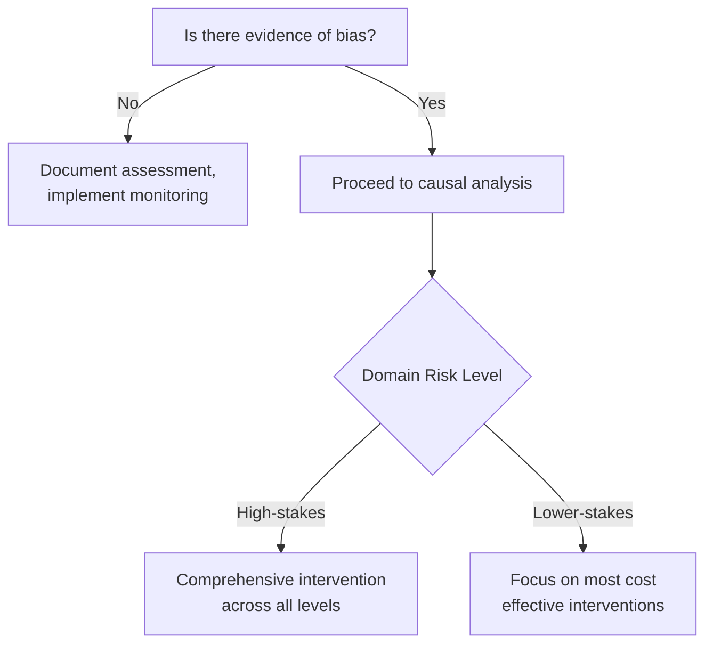
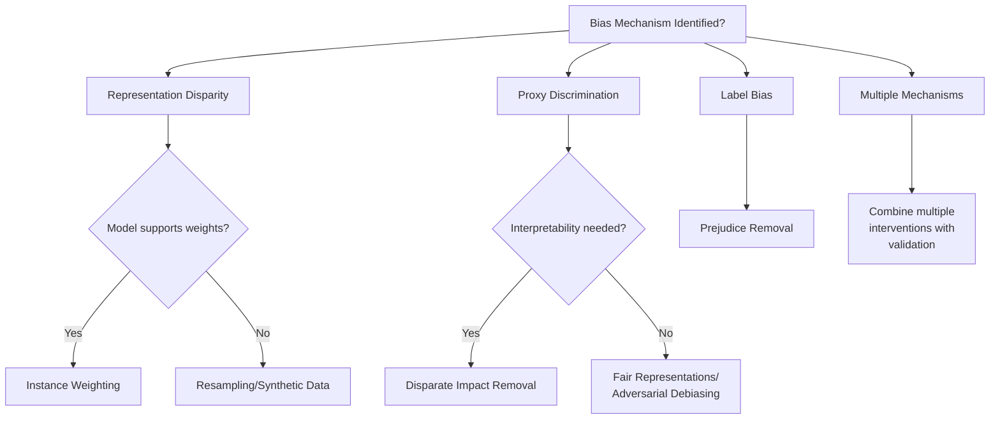
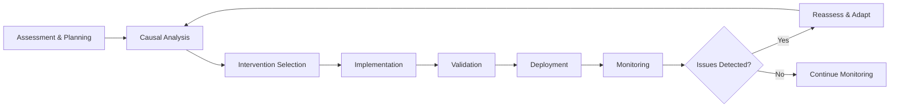

# 🚀 Implementation Guide
> How to Use the Fairness Intervention Playbook

## 🎯 Overview

This guide provides step-by-step instructions for implementing fairness interventions across your AI systems. It bridges the gap between theoretical fairness concepts and practical engineering implementation, ensuring you can effectively deploy fair AI solutions in production environments.

## 📋 Phase 1: Assessment and Planning

### 1.1 Initial Fairness Assessment

#### Objective
Determine if fairness intervention is needed and identify the scope.

#### Steps

##### 1. Stakeholder Identification
- **Identify affected user groups** and protected attributes
- **Document business context** and regulatory requirements
- **Engage domain experts** and legal counsel

##### 2. Data Audit
- Use the comprehensive **data auditing framework** from the Pre-Processing Toolkit
- **Analyze representation** across intersectional groups
- **Identify proxy variables** and correlation patterns
- **Calculate baseline fairness metrics**

##### 3. Risk Assessment
- **Evaluate potential harm** from biased decisions
- **Assess legal and reputational risks**
- **Determine intervention urgency** and resource allocation

### 1.2 Intervention Planning

#### Decision Framework

## 📊 Phase 2: Causal Analysis

### 2.1 Causal Model Construction

#### Objective
Understand how bias flows through your system to target interventions effectively.

#### Key Activities

##### 1. Variable Identification
- **Protected attributes** (race, gender, age, etc.)
- **Mediators** (influenced by protected attributes)
- **Proxies** (correlated but not causally related)
- **Outcomes and legitimate predictors**

##### 2. Causal Graph Development
- Use **domain knowledge** to map relationships
- **Distinguish direct, indirect, and proxy discrimination**
- **Validate with conditional independence tests**
- **Document assumptions and uncertainties**

##### 3. Counterfactual Analysis
- **Formulate "what if" queries**
- **Assess individual-level fairness**
- **Identify problematic causal pathways**

### 2.2 Bias Mechanism Classification

Use this classification to guide intervention selection:

| Bias Type | Description | Primary Intervention |
|-----------|-------------|---------------------|
| **Direct Discrimination** | Protected attribute directly influences outcome | Remove attribute, add constraints |
| **Proxy Discrimination** | Correlated features leak protected info | Feature transformation, adversarial debiasing |
| **Indirect Discrimination** | Protected attribute affects legitimate mediators | Multi-objective optimization, careful mediator handling |
| **Historical Bias** | Past discrimination embedded in training data | Reweighting, synthetic data generation |
| **Selection Bias** | Non-representative training samples | Resampling, domain adaptation |

## ⚙️ Phase 3: Intervention Selection and Implementation

### 3.1 Intervention Decision Tree

### 3.2 Implementation Sequence

#### Recommended Order
1. **Pre-Processing** (if significant data issues identified)
2. **In-Processing** (for systematic bias in model training)
3. **Post-Processing** (for final adjustments and calibration)

#### Integration Guidelines
- **Document all intervention parameters** and rationale
- **Use consistent fairness metrics** across interventions
- **Validate each intervention** before proceeding to the next
- **Consider interaction effects** between interventions

## ✅ Phase 4: Validation and Deployment

### 4.1 Validation Framework

#### Multi-Dimensional Assessment

##### 1. Fairness Metrics
- **Demographic parity**: P(Ŷ=1|A=0) = P(Ŷ=1|A=1)
- **Equal opportunity**: P(Ŷ=1|Y=1,A=0) = P(Ŷ=1|Y=1,A=1)
- **Equalized odds**: Equal TPR and FPR across groups
- **Intersectional metrics** for subgroups

##### 2. Performance Metrics
- **Overall accuracy, precision, recall**
- **Group-specific performance measures**
- **Calibration across protected groups**
- **Business metrics** (approval rates, revenue impact)

##### 3. Robustness Testing
- **Performance on held-out test sets**
- **Stability across different data distributions**
- **Sensitivity to hyperparameter changes**
- **Performance under distribution shift**

### 4.2 Documentation Requirements

#### Intervention Report Template
- **Problem Description**: Bias identified and evidence
- **Causal Analysis**: Mechanisms and pathways
- **Interventions Applied**: Techniques, parameters, rationale
- **Results**: Before/after metrics, trade-offs
- **Limitations**: Assumptions, uncertainties, residual risks
- **Monitoring Plan**: Ongoing assessment strategy

## 📈 Phase 5: Monitoring and Maintenance

### 5.1 Continuous Monitoring

#### Key Indicators
- **Fairness metric drift** over time
- **Changes in group representation**
- **Performance degradation signals**
- **User feedback and complaints**

#### Monitoring Infrastructure
- **Automated fairness metric calculation**
- **Alert systems** for significant changes
- **Regular manual audits** (quarterly/annually)
- **Stakeholder feedback loops**

### 5.2 Adaptation Guidelines

#### When to Reassess
- **Significant changes** in user population
- **New protected attributes** identified
- **Regulatory requirement changes**
- **Model performance degradation**
- **Incident reports** or bias complaints

## 🎯 Key Decision Points and Considerations

### Resource Requirements

| Component | Time Investment | Expertise Required | Tools Needed |
|-----------|----------------|-------------------|--------------|
| **Causal Analysis** | 2-4 weeks | Domain experts, data scientists | Causal modeling libraries |
| **Pre-Processing** | 1-2 weeks | Data engineers, statisticians | Data transformation tools |
| **In-Processing** | 2-3 weeks | ML engineers | Training frameworks |
| **Post-Processing** | 1 week | ML engineers | Threshold optimization tools |

### Risk Mitigation

#### Common Risks and Mitigation Strategies

##### 1. Fairness-Performance Trade-offs
- **Risk**: Significant accuracy loss
- **Mitigation**: Progressive intervention, multi-objective optimization

##### 2. Intersectional Bias
- **Risk**: Fixing one bias while creating another
- **Mitigation**: Explicit intersectional analysis and constraints

##### 3. Regulatory Compliance
- **Risk**: Interventions don't meet legal requirements
- **Mitigation**: Legal review, documentation, audit trails

##### 4. Implementation Complexity
- **Risk**: Teams struggle with technical implementation
- **Mitigation**: Clear templates, training, expert consultation

### Integration with Existing Processes

#### Development Workflow Integration
- **Include fairness assessment** in design reviews
- **Add fairness metrics** to CI/CD pipelines
- **Incorporate bias testing** in QA processes
- **Document fairness considerations** in model cards

#### Organizational Considerations
- **Train engineering teams** on fairness concepts
- **Establish fairness review boards** for high-risk applications
- **Create escalation paths** for complex cases
- **Align fairness goals** with business objectives

## 🔄 Workflow Overview

## 🌟 Success Patterns

### Technical Best Practices
- **Start simple**: Begin with basic interventions before complex solutions
- **Measure everything**: Comprehensive metrics at each stage
- **Iterate quickly**: Fast feedback loops for intervention effectiveness
- **Document thoroughly**: Maintain detailed records for auditing

### Organizational Best Practices
- **Cross-functional teams**: Include domain experts, engineers, and ethicists
- **Stakeholder engagement**: Regular communication with affected communities
- **Continuous learning**: Stay updated on fairness research and regulations
- **Culture integration**: Make fairness part of engineering culture

## ⚡ Quick Start Checklist

### Immediate Actions (Week 1)
- [ ] **Complete initial fairness assessment** for high-risk systems
- [ ] **Identify key stakeholders** and form fairness review team
- [ ] **Gather baseline data** and calculate current fairness metrics
- [ ] **Review regulatory requirements** relevant to your domain

### Short-term Goals (Month 1)
- [ ] **Implement basic monitoring** for existing systems
- [ ] **Complete causal analysis** for priority use cases
- [ ] **Select and test** initial interventions
- [ ] **Establish documentation standards**

### Medium-term Objectives (Quarter 1)
- [ ] **Deploy comprehensive interventions** for high-risk systems
- [ ] **Integrate fairness checks** into development workflows
- [ ] **Train engineering teams** on fairness concepts
- [ ] **Set up automated monitoring** infrastructure

### Long-term Vision (Year 1)
- [ ] **Fair AI by default** in all new development
- [ ] **Continuous fairness improvement** culture
- [ ] **Industry best practices** adoption and contribution
- [ ] **Stakeholder trust** and regulatory compliance

## 📚 Additional Resources

For detailed technical implementation of each toolkit component, see:
- [🔍 Causal Fairness Toolkit](./causal_fairness_toolkit.md)
- [🔧 Pre-Processing Fairness Toolkit](./preprocessing_toolkit.md)
- [⚙️ In-Processing Fairness Toolkit](./in_processing_toolkit.md)
- [🎛️ Post-Processing Fairness Toolkit](./post_processing_toolkit.md)
- [📊 Validation Framework](./validation_framework.md)

## 🎯 Key Takeaways

### Technical Implementation
- **Fairness is a system property** requiring intervention at multiple levels
- **Causal analysis is crucial** for targeting interventions effectively
- **Validation must be comprehensive** across fairness, performance, and robustness
- **Monitoring is essential** for maintaining fairness over time

### Organizational Success
- **Leadership commitment** is necessary for successful fairness initiatives
- **Cross-functional collaboration** improves intervention effectiveness
- **Stakeholder engagement** builds trust and identifies blind spots
- **Continuous improvement** adapts to changing requirements and knowledge

---

**Previous:** [README](./README.md) | **Next:** [Causal Fairness Toolkit](./causal_fairness_toolkit.md)

---

*Built with ❤️ for fair AI systems*
