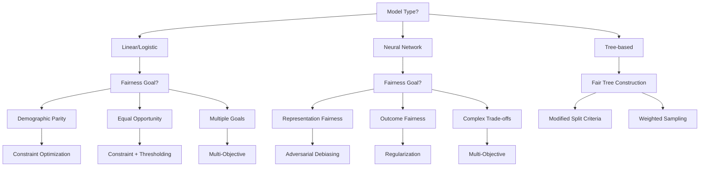

# In-Processing Fairness Toolkit

> Embed fairness constraints directly into model training for optimal performance-fairness balance

## 🎯 Overview

In-processing fairness interventions embed fairness considerations directly into the model training loop. Unlike pre-processing (which modifies data) or post-processing (which adjusts outputs), in-processing techniques train models to be inherently fair while optimizing for performance.

## 🔑 Key Principles

- **Fairness by Design**: Build fairness into the model architecture and training process
- **Joint Optimization**: Balance fairness and performance simultaneously during training
- **Model Agnostic**: Techniques that work across different model types and architectures
- **Intersectional Awareness**: Address multiple protected attributes and their intersections

## 🛠️ Core Techniques

### 1. Fairness Constraints Optimization

**When to Use:**
- Linear or convex models (logistic regression, SVM)
- Need theoretical guarantees
- Regulatory compliance requirements

**Implementation Pattern:**
```python
def constraint_optimization_example():
    """
    Add fairness constraints to the optimization objective
    """
    # Standard loss + fairness constraints
    total_loss = prediction_loss + lambda_fair * fairness_constraint
    
    # Supported fairness constraints:
    # - Demographic Parity: P(Ŷ=1|A=0) = P(Ŷ=1|A=1)
    # - Equal Opportunity: P(Ŷ=1|Y=1,A=0) = P(Ŷ=1|Y=1,A=1)
    # - Equalized Odds: Equal TPR and FPR across groups
    
    return total_loss
```

**Trade-offs:**
- ✅ Strong theoretical foundations
- ✅ Guaranteed fairness properties
- ❌ Limited to convex problems
- ❌ May require specialized solvers

### 2. Adversarial Debiasing

**When to Use:**
- Neural networks and deep learning models
- Complex, non-linear relationships
- Need representational fairness

**Architecture Pattern:**
```
Main Predictor ──→ Task Output (e.g., loan approval)
       │
       ├──→ Gradient Reversal Layer
       │
       └──→ Adversary ──→ Protected Attribute Prediction
```

**Implementation Steps:**
1. **Predictor**: Base model for main task
2. **Adversary**: Predicts protected attributes from representations
3. **Gradient Reversal Layer**: Reverses gradients from adversary
4. **Joint Training**: Optimize both objectives simultaneously

**Loss Function:**
```
L_combined = L_primary - λ * L_adversarial
```

**Training Schedule:**
- Start with low λ (0.1)
- Gradually increase to 1.0
- Use progressive training for stability

**Trade-offs:**
- ✅ Powerful for complex models
- ✅ Learns fair representations
- ❌ Training can be unstable
- ❌ Requires careful hyperparameter tuning

### 3. Fairness Regularization

**When to Use:**
- Need flexible fairness-performance trade-offs
- Working with various model types
- Want gradual fairness improvements

**Implementation Pattern:**
```python
def fairness_regularizer(predictions, protected_attributes, labels):
    """
    Add fairness penalty to loss function
    """
    # Demographic Parity penalty
    dp_penalty = demographic_parity_violation(predictions, protected_attributes)
    
    # Equal Opportunity penalty  
    eo_penalty = equal_opportunity_violation(predictions, protected_attributes, labels)
    
    # Combined penalty
    fairness_penalty = lambda_dp * dp_penalty + lambda_eo * eo_penalty
    
    return fairness_penalty
```

**Group-Specific Regularization:**
```python
def group_specific_regularizer(predictions, groups):
    """
    Apply different penalties for different groups
    """
    total_penalty = 0
    for group in groups:
        group_mask = (groups == group)
        group_penalty = compute_group_disparity(predictions[group_mask])
        total_penalty += lambda_group[group] * group_penalty
    
    return total_penalty
```

**Trade-offs:**
- ✅ Flexible and stable
- ✅ Works with many model types
- ✅ Allows fine-tuned trade-offs
- ❌ Requires hyperparameter tuning
- ❌ May not achieve perfect fairness

### 4. Multi-Objective Optimization

**When to Use:**
- Multiple conflicting fairness goals
- Need explicit trade-off management
- Stakeholder involvement in decision-making

**Core Concepts:**

**Pareto Optimality**: No objective can be improved without degrading another

**Scalarization Methods:**
```python
def multi_objective_loss(params, weights):
    """
    Convert multi-objective to single objective
    """
    accuracy_loss = calculate_accuracy_loss(params)
    fairness_loss = calculate_fairness_loss(params)
    interpretability_loss = calculate_complexity_loss(params)
    
    return (weights['accuracy'] * accuracy_loss + 
            weights['fairness'] * fairness_loss + 
            weights['interpretability'] * interpretability_loss)
```

**Preference Articulation:**
- **A priori**: Set preferences before optimization
- **A posteriori**: Generate options, then choose
- **Interactive**: Iterative refinement with stakeholders

**Trade-offs:**
- ✅ Explicit trade-off management
- ✅ Stakeholder involvement
- ✅ Principled decision framework
- ❌ Computationally expensive
- ❌ Requires stakeholder engagement

## 🏗️ Model Architecture Analysis

### Compatibility Matrix

| Model Type | Constraints | Adversarial | Regularization | Multi-Objective |
|------------|-------------|-------------|----------------|-----------------|
| **Linear Models** | ✅ High | ❌ Low | ✅ High | ✅ Medium |
| **Tree-based** | ❌ Low | ❌ Low | ⚠️ Medium | ⚠️ Medium |
| **Neural Networks** | ⚠️ Medium | ✅ High | ✅ High | ✅ High |
| **Ensemble Methods** | ❌ Low | ❌ Low | ✅ High | ⚠️ Medium |

### Decision Tree for Technique Selection



## 🔄 Implementation Workflow

### Phase 1: Architecture Analysis
1. **Identify Model Type**
   - Linear, tree-based, neural network, ensemble
2. **Document Constraints**
   - Compute budget, training time, explainability needs
3. **Assess Compatibility**
   - Use compatibility matrix above

### Phase 2: Technique Selection
1. **Define Fairness Goals**
   - Demographic parity, equal opportunity, equalized odds
2. **Consider Constraints**
   - Performance requirements, interpretability, resources
3. **Select Primary Method**
   - Use decision tree above

### Phase 3: Implementation
1. **Baseline Training**
   - Train without fairness constraints
   - Record performance and fairness metrics
2. **Fair Training**
   - Implement chosen technique
   - Tune hyperparameters (λ, learning rates, schedules)
3. **Stability Measures**
   - Progressive training schedules
   - Gradient clipping/normalization
   - Early stopping with fairness-performance balance

### Phase 4: Validation
1. **Fairness Evaluation**
   - Measure improvement in fairness metrics
   - Test across intersectional subgroups
2. **Performance Assessment**
   - Quantify performance trade-offs
   - Ensure acceptable degradation
3. **Robustness Testing**
   - Test across different data splits
   - Evaluate under distribution shift

## 📊 Evaluation Framework

### Success Criteria
- **Fairness Improvement**: ≥ X% reduction in bias metrics
- **Performance Preservation**: ≤ Y% accuracy loss
- **Robustness**: Consistent results across groups and conditions
- **Stability**: Reliable training convergence

### Metrics to Track
```python
evaluation_metrics = {
    'fairness': [
        'demographic_parity_difference',
        'equal_opportunity_difference', 
        'equalized_odds_difference',
        'intersectional_fairness_gap'
    ],
    'performance': [
        'accuracy', 'precision', 'recall', 'f1_score',
        'auc_roc', 'business_kpi'
    ],
    'training': [
        'convergence_stability',
        'training_time',
        'hyperparameter_sensitivity'
    ]
}
```

## 🧩 Intersectional Fairness Considerations

### Multi-Attribute Adversaries
```python
def intersectional_adversary():
    """
    Adversary that predicts multiple protected attributes
    """
    # Individual attribute predictions
    gender_pred = predict_gender(hidden_representation)
    race_pred = predict_race(hidden_representation)
    age_pred = predict_age(hidden_representation)
    
    # Intersectional predictions
    intersection_pred = predict_intersection(hidden_representation)
    
    # Combined adversarial loss
    adv_loss = (gender_loss + race_loss + age_loss + 
                intersection_loss)
    
    return adv_loss
```

### Hierarchical Regularization
- Apply stronger penalties to marginalized intersections
- Use group-specific λ values
- Borrow strength from similar groups for small subgroups

## ⚠️ Common Implementation Challenges

### Training Instability (Adversarial Methods)
**Symptoms:**
- Oscillating losses
- Mode collapse
- Gradient explosion

**Solutions:**
- Progressive λ scheduling
- Asymmetric learning rates (adversary 2-5x slower)
- Gradient clipping and normalization
- Spectral normalization for adversary
- Pre-train predictor before adding adversary

### Hyperparameter Sensitivity
**Challenge:** Fairness methods often require careful tuning

**Mitigation:**
- Use validation-based early stopping
- Grid search over λ values
- Monitor both fairness and performance
- Document optimal ranges for similar problems

### Computational Resources
**Challenge:** Some methods significantly increase training time

**Solutions:**
- Start with simple methods (regularization)
- Use progressive complexity (constraint → regularization → adversarial)
- Implement efficient approximations for large-scale problems

## 📈 Case Study Integration

The in-processing toolkit connects to other components:

**From Causal Analysis:**
- Use identified mediator variables to focus regularization
- Apply interventions at appropriate causal points

**To Post-Processing:**
- If in-processing insufficient, chain with post-processing
- Use in-processing for global fairness, post-processing for fine-tuning

**Integration with Pre-Processing:**
- Pre-processing handles data quality issues
- In-processing handles training dynamics
- Combined approach often most effective

## 🔗 Code Templates

### Adversarial Training Template
```python
class FairAdversarialTraining:
    def __init__(self, predictor, adversary, lambda_schedule):
        self.predictor = predictor
        self.adversary = adversary
        self.lambda_schedule = lambda_schedule
    
    def train_step(self, batch, epoch):
        # Forward pass
        predictions = self.predictor(batch.features)
        protected_preds = self.adversary(self.predictor.hidden)
        
        # Losses
        task_loss = self.task_loss(predictions, batch.labels)
        adv_loss = self.adversarial_loss(protected_preds, batch.protected)
        
        # Combined loss with schedule
        lambda_t = self.lambda_schedule(epoch)
        total_loss = task_loss - lambda_t * adv_loss
        
        return total_loss
```

### Fairness Regularization Template
```python
class FairnessRegularizer:
    def __init__(self, fairness_type='demographic_parity'):
        self.fairness_type = fairness_type
    
    def compute_penalty(self, predictions, protected_attrs, labels=None):
        if self.fairness_type == 'demographic_parity':
            return self._demographic_parity_penalty(predictions, protected_attrs)
        elif self.fairness_type == 'equal_opportunity':
            return self._equal_opportunity_penalty(predictions, protected_attrs, labels)
        # ... other fairness types
    
    def _demographic_parity_penalty(self, predictions, protected_attrs):
        # Implementation of DP penalty
        pass
```

## 🎯 Best Practices

1. **Start Simple**: Begin with regularization before trying adversarial methods
2. **Monitor Training**: Watch both fairness and performance metrics during training
3. **Progressive Complexity**: Increase fairness pressure gradually
4. **Validate Thoroughly**: Test on held-out data with intersectional analysis
5. **Document Trade-offs**: Record all fairness-performance decisions
6. **Plan for Deployment**: Consider inference-time constraints

## 📚 Further Reading

- **Adversarial Debiasing**: Zhang et al. (2018) - "Mitigating Unwanted Biases with Adversarial Learning"
- **Fairness Constraints**: Agarwal et al. (2018) - "A Reductions Approach to Fair Classification"
- **Multi-Objective Fairness**: Co-Reyes et al. (2021) - "Multi-objective Optimization in Fairness-aware Machine Learning"

## 🔗 Navigation
**Previous:** [Pre-Processing Fairness Toolkit](./preprocessing_toolkit.md) | **Next:** [Post-Processing Fairness Toolkit](./post_processing_toolkit.md) | **Home:** [Main README](./README.md)
