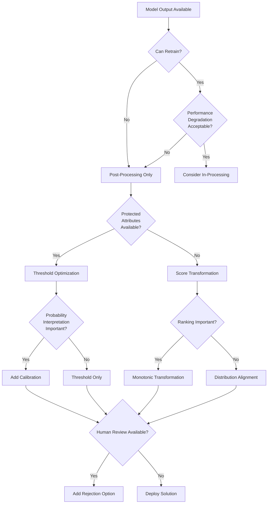

# Post-Processing Fairness Toolkit

> Fix fairness issues in deployed models without retraining - ideal for production systems and legacy models

## 🎯 Overview

Post-processing fairness interventions adjust model outputs after training to satisfy fairness criteria. These techniques are particularly valuable for deployed systems, third-party models, or situations where retraining is not feasible due to regulatory, technical, or resource constraints.

## 🔑 Key Advantages

- **No Retraining Required**: Work with existing, deployed models
- **Model Agnostic**: Apply to any model that produces predictions
- **Regulatory Friendly**: Minimal changes to validated systems
- **Fast Implementation**: Quick deployment of fairness fixes
- **Reversible**: Can be adjusted or removed without model changes

## 🛠️ Core Techniques

## 1. Threshold Optimization

**Purpose**: Adjust decision boundaries per group to achieve fairness goals

**When to Use:**
- Binary classification tasks
- Need equal opportunity or demographic parity
- Have access to protected attributes during inference

### Fairness Criteria Supported

| Criterion | Mathematical Definition | Implementation |
|-----------|------------------------|----------------|
| **Demographic Parity** | P(Ŷ=1\|A=a) = P(Ŷ=1\|A=b) | Equal selection rates |
| **Equal Opportunity** | P(Ŷ=1\|Y=1,A=a) = P(Ŷ=1\|Y=1,A=b) | Equal TPR across groups |
| **Equalized Odds** | Equal TPR and FPR | Equal error rates |

### Implementation Framework

```python
class ThresholdOptimizer:
    def __init__(self, fairness_criterion='equal_opportunity'):
        self.fairness_criterion = fairness_criterion
        self.thresholds = {}
    
    def fit(self, y_scores, y_true, protected_attrs):
        """Learn optimal thresholds per group"""
        for group in protected_attrs.unique():
            mask = (protected_attrs == group)
            group_scores = y_scores[mask]
            group_labels = y_true[mask]
            
            # Find threshold maximizing utility subject to fairness
            self.thresholds[group] = self._optimize_threshold(
                group_scores, group_labels, self.fairness_criterion
            )
    
    def predict(self, y_scores, protected_attrs):
        """Apply group-specific thresholds"""
        predictions = np.zeros_like(y_scores)
        for group in self.thresholds:
            mask = (protected_attrs == group)
            predictions[mask] = (y_scores[mask] >= self.thresholds[group])
        return predictions
```

### Constraint Handling

**With Protected Attributes:**
- Apply group-specific thresholds directly
- Most accurate but requires legal review

**Without Protected Attributes:**
- Use proxy-based thresholding
- Multi-threshold schemes based on risk scores
- Trade accuracy for legal compliance

### ROC-Based Threshold Selection

```python
def find_fair_thresholds(y_scores, y_true, groups):
    """
    Find thresholds that equalize TPR across groups
    """
    thresholds = {}
    target_tpr = None
    
    # Step 1: Find achievable TPR range
    tpr_ranges = {}
    for group in groups.unique():
        mask = (groups == group)
        fpr, tpr, thresh = roc_curve(y_true[mask], y_scores[mask])
        tpr_ranges[group] = (tpr.min(), tpr.max())
    
    # Step 2: Find common TPR target
    max_min_tpr = max(tpr_range[0] for tpr_range in tpr_ranges.values())
    min_max_tpr = min(tpr_range[1] for tpr_range in tpr_ranges.values())
    target_tpr = (max_min_tpr + min_max_tpr) / 2
    
    # Step 3: Find thresholds achieving target TPR
    for group in groups.unique():
        mask = (groups == group)
        fpr, tpr, thresh = roc_curve(y_true[mask], y_scores[mask])
        # Find threshold closest to target TPR
        idx = np.argmin(np.abs(tpr - target_tpr))
        thresholds[group] = thresh[idx]
    
    return thresholds, target_tpr
```

## 2. Calibration Across Groups

**Purpose**: Ensure predicted probabilities have consistent meaning across demographic groups

**When to Use:**
- Probability outputs are directly interpreted
- Risk assessment applications
- Need consistent score interpretation

### Core Problem
Even accurate models can be miscalibrated across groups:
- 70% predicted risk → 85% actual risk for Group A
- 70% predicted risk → 55% actual risk for Group B

### Calibration Techniques

#### Platt Scaling
```python
class PlattCalibrator:
    def __init__(self):
        self.calibrators = {}
    
    def fit(self, scores, labels, groups):
        """Fit logistic regression per group"""
        for group in groups.unique():
            mask = (groups == group)
            calibrator = LogisticRegression()
            calibrator.fit(scores[mask].reshape(-1, 1), labels[mask])
            self.calibrators[group] = calibrator
    
    def transform(self, scores, groups):
        """Apply group-specific calibration"""
        calibrated = np.zeros_like(scores)
        for group in self.calibrators:
            mask = (groups == group)
            calibrated[mask] = self.calibrators[group].predict_proba(
                scores[mask].reshape(-1, 1)
            )[:, 1]
        return calibrated
```

#### Isotonic Regression
- Non-parametric approach
- Preserves ranking order
- Flexible for complex miscalibration patterns

#### Temperature Scaling
- Simple scaling of logits for neural networks
- Single parameter per group
- Preserves relative predictions

### Evaluation Metrics

**Expected Calibration Error (ECE):**
```python
def expected_calibration_error(y_true, y_prob, n_bins=10):
    """Calculate ECE across probability bins"""
    bin_boundaries = np.linspace(0, 1, n_bins + 1)
    bin_lowers = bin_boundaries[:-1]
    bin_uppers = bin_boundaries[1:]
    
    ece = 0
    for bin_lower, bin_upper in zip(bin_lowers, bin_uppers):
        in_bin = (y_prob > bin_lower) & (y_prob <= bin_upper)
        prop_in_bin = in_bin.mean()
        
        if prop_in_bin > 0:
            accuracy_in_bin = y_true[in_bin].mean()
            avg_confidence_in_bin = y_prob[in_bin].mean()
            ece += np.abs(avg_confidence_in_bin - accuracy_in_bin) * prop_in_bin
    
    return ece
```

### The Calibration-Fairness Trade-off

**Impossibility Result** (Kleinberg et al., 2016):
Cannot simultaneously achieve:
- Calibration
- Equal False Positive Rate  
- Equal False Negative Rate
(unless base rates are equal across groups)

**Practical Approach:**
- Prioritize based on use case
- Risk assessment → Calibration priority
- Selection decisions → Error rate priority
- Document trade-off rationale

## 3. Prediction Transformation Methods

**Purpose**: Transform model outputs to meet fairness constraints while preserving information

**When to Use:**
- Need to preserve ranking within groups
- Recommendation and scoring systems
- Cannot access model internals

### Learned Transformation Functions

```python
class FairTransformer:
    def __init__(self, transformation_type='monotonic'):
        self.transformation_type = transformation_type
        self.transformers = {}
    
    def fit(self, predictions, protected_attrs, labels):
        """Learn group-specific transformations"""
        for group in protected_attrs.unique():
            mask = (protected_attrs == group)
            group_preds = predictions[mask]
            group_labels = labels[mask]
            
            if self.transformation_type == 'monotonic':
                # Isotonic regression preserving order
                transformer = IsotonicRegression(out_of_bounds='clip')
                transformer.fit(group_preds, group_labels)
            elif self.transformation_type == 'quantile':
                # Quantile-based transformation
                transformer = QuantileTransformer()
                transformer.fit(group_preds.reshape(-1, 1))
            
            self.transformers[group] = transformer
    
    def transform(self, predictions, protected_attrs):
        """Apply learned transformations"""
        transformed = np.zeros_like(predictions)
        for group in self.transformers:
            mask = (protected_attrs == group)
            if self.transformation_type == 'monotonic':
                transformed[mask] = self.transformers[group].transform(
                    predictions[mask]
                )
            elif self.transformation_type == 'quantile':
                transformed[mask] = self.transformers[group].transform(
                    predictions[mask].reshape(-1, 1)
                ).flatten()
        return transformed
```

### Distribution Alignment Techniques

**Quantile Matching:**
```python
def quantile_alignment(scores_source, scores_target, n_quantiles=100):
    """Align score distributions using quantile mapping"""
    # Compute quantiles for both distributions
    quantiles = np.linspace(0, 1, n_quantiles)
    source_quantiles = np.quantile(scores_source, quantiles)
    target_quantiles = np.quantile(scores_target, quantiles)
    
    # Create mapping function
    def transform_score(score):
        # Find position in source distribution
        pos = np.searchsorted(source_quantiles, score) / len(source_quantiles)
        # Map to target distribution
        return np.interp(pos, quantiles, target_quantiles)
    
    return np.vectorize(transform_score)
```

**Optimal Transport:**
- Minimize cost of moving probability mass
- Preserves important distributional properties
- More sophisticated than quantile matching

## 4. Rejection Option Classification

**Purpose**: Defer uncertain or fairness-risky predictions to human reviewers

**When to Use:**
- High-stakes decisions
- Uncertainty about fairness in specific cases
- Human oversight is available and valuable

### Framework Components

#### Confidence-Based Rejection
```python
class FairRejectionClassifier:
    def __init__(self, confidence_threshold=0.8, fairness_threshold=0.1):
        self.confidence_threshold = confidence_threshold
        self.fairness_threshold = fairness_threshold
        self.group_thresholds = {}
    
    def fit(self, predictions, confidence, protected_attrs, labels):
        """Learn group-specific rejection thresholds"""
        for group in protected_attrs.unique():
            mask = (protected_attrs == group)
            
            # Analyze confidence vs. fairness risk
            group_conf = confidence[mask]
            group_pred = predictions[mask]
            group_true = labels[mask]
            
            # Find confidence threshold that minimizes fairness risk
            self.group_thresholds[group] = self._optimize_rejection_threshold(
                group_conf, group_pred, group_true
            )
    
    def predict_with_rejection(self, predictions, confidence, protected_attrs):
        """Make predictions with rejection option"""
        result = []
        for i, (pred, conf, group) in enumerate(zip(predictions, confidence, protected_attrs)):
            if conf < self.group_thresholds[group]:
                result.append('REJECT')  # Defer to human
            else:
                result.append(pred)
        return np.array(result)
```

#### Cost-Sensitive Rejection
```python
def cost_sensitive_rejection_threshold(predictions, labels, groups, costs):
    """
    Find rejection threshold minimizing expected cost
    
    costs: dict with keys 'fp', 'fn', 'human_review'
    """
    thresholds = {}
    
    for group in groups.unique():
        mask = (groups == group)
        group_preds = predictions[mask]
        group_labels = labels[mask]
        
        best_threshold = 0
        min_cost = float('inf')
        
        for threshold in np.linspace(0, 1, 100):
            # Predictions above threshold are automated
            automated_mask = group_preds >= threshold
            
            if automated_mask.sum() > 0:
                # Calculate error costs for automated decisions
                fp_cost = costs['fp'] * ((group_preds[automated_mask] >= 0.5) & 
                                       (group_labels[automated_mask] == 0)).sum()
                fn_cost = costs['fn'] * ((group_preds[automated_mask] < 0.5) & 
                                       (group_labels[automated_mask] == 1)).sum()
            else:
                fp_cost = fn_cost = 0
            
            # Cost of human review for rejected cases
            review_cost = costs['human_review'] * (~automated_mask).sum()
            
            total_cost = fp_cost + fn_cost + review_cost
            
            if total_cost < min_cost:
                min_cost = total_cost
                best_threshold = threshold
        
        thresholds[group] = best_threshold
    
    return thresholds
```

### Human-AI Collaboration Design

**Interface Principles:**
- Don't reveal protected attributes explicitly
- Provide uncertainty indicators
- Show reasons for deferral
- Enable structured decision-making

**Feedback Integration:**
```python
class HumanFeedbackIntegrator:
    def __init__(self):
        self.human_decisions = []
        self.model_predictions = []
    
    def record_human_decision(self, case_id, human_decision, model_prediction, 
                            confidence, protected_group):
        """Record human reviewer decisions"""
        self.human_decisions.append({
            'case_id': case_id,
            'human_decision': human_decision,
            'model_prediction': model_prediction,
            'confidence': confidence,
            'protected_group': protected_group
        })
    
    def analyze_human_model_disagreement(self):
        """Identify patterns in human-model disagreement"""
        df = pd.DataFrame(self.human_decisions)
        
        # Group by protected attributes
        disagreement_by_group = df.groupby('protected_group').apply(
            lambda x: (x['human_decision'] != x['model_prediction']).mean()
        )
        
        return disagreement_by_group
    
    def update_rejection_thresholds(self):
        """Use human feedback to refine rejection criteria"""
        # Analyze cases where human decisions differed significantly
        # Update confidence thresholds to catch similar cases
        pass
```

## 📊 Integration Workflow

### Decision Framework



### Implementation Sequence

1. **Assessment Phase**
   - Evaluate current fairness metrics
   - Identify primary fairness violations
   - Document constraints (legal, technical, business)

2. **Technique Selection**
   - Use decision framework above
   - Consider multiple techniques for comprehensive solution
   - Plan for iterative improvement

3. **Implementation Phase**
   - Start with simplest effective technique
   - Validate on hold-out data
   - A/B test in production if possible

4. **Monitoring Phase**
   - Track fairness metrics over time
   - Monitor for drift in both fairness and performance
   - Plan for periodic recalibration

## 📈 Evaluation Framework

### Comprehensive Evaluation Metrics

```python
def evaluate_post_processing_intervention(y_true, y_pred_before, y_pred_after, 
                                        protected_attrs, y_scores_before=None, 
                                        y_scores_after=None):
    """
    Comprehensive evaluation of post-processing intervention
    """
    results = {}
    
    # Fairness improvements
    results['fairness_before'] = {
        'demographic_parity': demographic_parity_difference(y_true, y_pred_before, protected_attrs),
        'equal_opportunity': equal_opportunity_difference(y_true, y_pred_before, protected_attrs),
        'equalized_odds': equalized_odds_difference(y_true, y_pred_before, protected_attrs)
    }
    
    results['fairness_after'] = {
        'demographic_parity': demographic_parity_difference(y_true, y_pred_after, protected_attrs),
        'equal_opportunity': equal_opportunity_difference(y_true, y_pred_after, protected_attrs),
        'equalized_odds': equalized_odds_difference(y_true, y_pred_after, protected_attrs)
    }
    
    # Performance impact
    results['performance_before'] = {
        'accuracy': accuracy_score(y_true, y_pred_before),
        'precision': precision_score(y_true, y_pred_before),
        'recall': recall_score(y_true, y_pred_before),
        'f1': f1_score(y_true, y_pred_before)
    }
    
    results['performance_after'] = {
        'accuracy': accuracy_score(y_true, y_pred_after),
        'precision': precision_score(y_true, y_pred_after),
        'recall': recall_score(y_true, y_pred_after),
        'f1': f1_score(y_true, y_pred_after)
    }
    
    # Calibration assessment (if scores available)
    if y_scores_before is not None and y_scores_after is not None:
        results['calibration_before'] = expected_calibration_error(y_true, y_scores_before)
        results['calibration_after'] = expected_calibration_error(y_true, y_scores_after)
    
    return results
```

### Intersectional Evaluation

```python
def intersectional_fairness_assessment(y_true, y_pred, protected_attrs_dict):
    """
    Evaluate fairness across intersectional groups
    
    protected_attrs_dict: {'race': [...], 'gender': [...], 'age': [...]}
    """
    # Create intersectional groups
    intersectional_groups = pd.MultiIndex.from_arrays(
        [protected_attrs_dict[attr] for attr in protected_attrs_dict.keys()],
        names=list(protected_attrs_dict.keys())
    )
    
    # Evaluate metrics for each intersection
    results = {}
    for intersection in intersectional_groups.unique():
        mask = (intersectional_groups == intersection)
        if mask.sum() > 10:  # Sufficient sample size
            group_performance = {
                'accuracy': accuracy_score(y_true[mask], y_pred[mask]),
                'precision': precision_score(y_true[mask], y_pred[mask]),
                'recall': recall_score(y_true[mask], y_pred[mask])
            }
            results[str(intersection)] = group_performance
    
    return results
```

## ⚠️ Common Challenges and Solutions

### 1. Legal and Ethical Constraints

**Challenge**: Cannot use protected attributes at inference time

**Solutions:**
- **Proxy-based approaches**: Use correlated features
- **Score transformation**: Adjust distributions without explicit grouping
- **Multi-threshold systems**: Apply different thresholds based on risk levels

### 2. Limited Data for Calibration

**Challenge**: Small group sizes affect calibration quality

**Solutions:**
- **Hierarchical calibration**: Borrow strength from similar groups
- **Bayesian approaches**: Account for uncertainty in small samples
- **Regularized calibration**: Add smoothness constraints

### 3. Maintaining Performance

**Challenge**: Post-processing can significantly degrade performance

**Solutions:**
- **Pareto optimization**: Find best performance-fairness trade-offs
- **Selective application**: Apply only to borderline cases
- **Multi-stage approaches**: Combine with pre-processing for better results

### 4. Distribution Shift

**Challenge**: Fairness interventions may not generalize to new data

**Solutions:**
- **Continuous monitoring**: Track fairness metrics over time
- **Adaptive thresholds**: Update based on recent performance
- **Robustness testing**: Evaluate under various scenarios

## 🎯 Best Practices

### 1. Start Simple
- Begin with threshold optimization
- Add complexity only when necessary
- Document all decisions and trade-offs

### 2. Validate Thoroughly
- Use separate validation data for fairness tuning
- Test across all relevant demographic groups
- Evaluate intersectional fairness, not just main effects

### 3. Plan for Production
- Consider inference-time constraints
- Implement efficient lookup systems for transformations
- Plan for periodic recalibration

### 4. Engage Stakeholders
- Explain trade-offs in business terms
- Involve domain experts in threshold selection
- Document ethical and legal considerations

### 5. Monitor Continuously
- Track fairness metrics in production
- Set up alerts for fairness degradation
- Plan for regular intervention updates

## 📚 Integration with Other Toolkits

### From Pre-Processing
- Use cleaned, balanced data as input
- Build on feature transformations already applied
- Consider combined approach for maximum effectiveness

### From In-Processing  
- Apply when in-processing insufficient
- Use for fine-tuning fair models
- Handle cases where retraining not feasible

### To Validation Framework
- Feed results into comprehensive evaluation
- Support long-term monitoring and maintenance
- Provide metrics for business impact assessment


## 🔗 Navigation
**Previous:** [In-Processing Fairness Toolkit](./in_processing_toolkit.md) | **Next:** [Validation Framework](./validation_framework.md) | **Home:** [Main README](./README.md)
