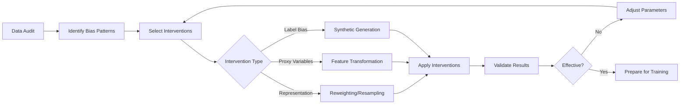

# 🔧 Pre-Processing Fairness Toolkit 
> Addressing Bias at the Data Level

## 🎯 Overview

The Pre-Processing Fairness Toolkit provides systematic methods to identify and remediate bias in training data before it reaches the model. This proactive approach addresses bias at its source, often providing the most effective and interpretable fairness interventions.

## 📋 When to Use This Toolkit

- **Causal analysis reveals** data-level bias mechanisms
- **Significant representation disparities** across protected groups
- **Historical discrimination** embedded in training labels
- **Proxy variables** leaking protected attribute information
- Need for **interpretable fairness interventions**

## 🏗️ Core Components

### Component 1: 🔍 Comprehensive Data Auditing Framework

#### Purpose
Systematically identify bias patterns in datasets to guide intervention selection. Think of this as a "bias diagnostic tool" that reveals hidden problems in your data.

#### Why Data Auditing Matters:
- **Hidden Bias Detection**: Reveals bias patterns not visible in basic statistics
- **Intervention Guidance**: Different bias types require different solutions
- **Legal/Compliance**: Documentation of bias assessment for regulatory purposes
- **Resource Prioritization**: Focus efforts on the most problematic areas

#### Auditing Checklist

##### 1.1 Representation Analysis
**What it does**: Examines whether different demographic groups are fairly represented in your dataset.

**Key Questions Answered**:
- Are some groups severely underrepresented?
- Does the data match real-world demographics?
- Which intersectional groups have insufficient data?

```python
def analyze_representation(data, protected_attrs, reference_population=None):
    """
    Comprehensive representation analysis across protected attributes
    
    This function performs three types of analysis:
    1. Basic Distribution: What percentage of each group is in the data?
    2. Bias Scoring: How much does data deviate from expected representation?
    3. Intersectional Analysis: Are combinations of attributes adequately represented?
    
    Example Output:
    - Gender: Male 65%, Female 35% (Expected: 50%/50% → High bias)
    - Race: White 80%, Black 12%, Hispanic 8% (Expected: 60%/20%/20% → Medium bias)
    - Intersectional: Black Women only 4% of dataset → Very low representation
    """
    
    results = {}
    
    for attr in protected_attrs:
        # Step 1: Calculate actual distribution in your data
        attr_counts = data[attr].value_counts(normalize=True)
        results[attr] = {'distribution': attr_counts}
        
        # Step 2: Compare to reference population (if available)
        if reference_population and attr in reference_population:
            reference_dist = reference_population[attr]
            # Calculate how much your data deviates from expected representation
            bias_score = calculate_representation_bias(attr_counts, reference_dist)
            results[attr]['bias_score'] = bias_score
        
        # Step 3: Analyze intersectional representation
        if len(protected_attrs) > 1:
            # Look at combinations: Gender × Race, Age × Gender, etc.
            intersectional_dist = data.groupby(protected_attrs).size() / len(data)
            results['intersectional'] = intersectional_dist
    
    return results

def calculate_representation_bias(observed, expected):
    """
    Calculate bias score using Total Variation Distance
    
    Returns value between 0 (perfect match) and 1 (completely different)
    - 0.0-0.1: Low bias (acceptable)
    - 0.1-0.3: Medium bias (concerning)  
    - 0.3+: High bias (intervention required)
    """
    return sum(abs(observed - expected)) / 2  # Total variation distance
```

##### 1.2 Correlation Pattern Detection
**What it does**: Identifies features that might serve as "proxies" for protected attributes, potentially enabling indirect discrimination.

**Key Concepts**:
- **Proxy Variables**: Features correlated with protected attributes (e.g., ZIP code correlating with race)
- **Indirect Discrimination**: Using proxies to make decisions that have disparate impact
- **Legal Risk**: Using proxies can violate anti-discrimination laws even if unintentional

```python
def detect_proxy_variables(data, protected_attrs, threshold=0.3):
    """
    Identify features that may serve as proxies for protected attributes
    
    Why this matters:
    - Even if you remove gender from your model, using "interest in sports" 
      might still discriminate if it's highly correlated with gender
    - ZIP code might be a proxy for race due to residential segregation
    - Educational institution might correlate with socioeconomic background
    
    Method:
    1. For continuous features: Use Pearson correlation
    2. For categorical features: Use Cramér's V (measures association strength)
    3. Flag any feature with correlation above threshold
    """
    
    proxy_candidates = {}
    
    for attr in protected_attrs:
        correlations = {}
        
        # Analyze continuous features (income, age, credit score, etc.)
        numeric_features = data.select_dtypes(include=[np.number]).columns
        for feature in numeric_features:
            if feature != attr:
                # Convert protected attribute to numeric for correlation calculation
                corr = abs(data[attr].astype('category').cat.codes.corr(data[feature]))
                if corr > threshold:
                    correlations[feature] = corr
        
        # Analyze categorical features (education, job title, ZIP code, etc.)
        categorical_features = data.select_dtypes(include=['object', 'category']).columns
        for feature in categorical_features:
            if feature != attr:
                # Use Cramér's V for categorical-categorical associations
                cramers_v = calculate_cramers_v(data[attr], data[feature])
                if cramers_v > threshold:
                    correlations[feature] = cramers_v
        
        proxy_candidates[attr] = correlations
    
    return proxy_candidates

def calculate_cramers_v(x, y):
    """
    Calculate Cramér's V statistic for measuring association between categorical variables
    
    Returns value between 0 (no association) and 1 (perfect association)
    - Cramér's V > 0.5: Strong association (likely proxy)
    - Cramér's V 0.3-0.5: Moderate association (investigate further)
    - Cramér's V < 0.3: Weak association (probably safe)
    
    Example: Cramér's V between "Job Title" and "Gender" might be 0.7
    indicating that job titles strongly predict gender (potential bias source)
    """
    confusion_matrix = pd.crosstab(x, y)
    chi2 = stats.chi2_contingency(confusion_matrix)[0]
    n = confusion_matrix.sum().sum()
    phi2 = chi2 / n
    r, k = confusion_matrix.shape
    phi2corr = max(0, phi2 - ((k-1)*(r-1))/(n-1))
    rcorr = r - ((r-1)**2)/(n-1)
    kcorr = k - ((k-1)**2)/(n-1)
    return np.sqrt(phi2corr / min((kcorr-1), (rcorr-1)))
```

##### 1.3 Label Quality Assessment
**What it does**: Identifies potential bias in the target labels themselves, which is often the most serious form of bias.

**Common Sources of Label Bias**:
- **Historical Discrimination**: Past biased decisions baked into training labels
- **Measurement Bias**: Different quality of data collection across groups
- **Confirmation Bias**: Human labelers bringing unconscious biases

```python
def assess_label_bias(data, outcome_col, protected_attrs):
    """
    Assess potential bias in outcome labels
    
    This function performs two critical analyses:
    1. Crude Bias Detection: Simple outcome rate differences between groups
    2. Conditional Bias Analysis: Bias that remains after controlling for other factors
    
    Example Scenario:
    - Crude analysis shows women get loans 60% vs men 70% → Potential bias
    - But controlling for income, credit score, etc., the gap becomes 68% vs 70% → Less bias
    - The remaining 2% gap might indicate pure discrimination
    """
    
    bias_indicators = {}
    
    # Step 1: Crude bias analysis - simple outcome rate differences
    for attr in protected_attrs:
        group_rates = data.groupby(attr)[outcome_col].mean()
        rate_disparity = group_rates.max() - group_rates.min()
        bias_indicators[f'{attr}_rate_disparity'] = rate_disparity
        
        # Interpretation guide:
        # 0-0.05 (0-5%): Low disparity, probably acceptable
        # 0.05-0.1 (5-10%): Moderate disparity, investigate further  
        # 0.1+ (10%+): High disparity, likely bias present
    
    # Step 2: Conditional bias analysis - control for legitimate factors
    feature_cols = [col for col in data.columns if col not in protected_attrs + [outcome_col]]
    
    for attr in protected_attrs:
        # Use logistic regression to control for other factors
        # This estimates bias that can't be explained by legitimate factors
        X = pd.get_dummies(data[feature_cols + [attr]])
        y = data[outcome_col]
        
        model = LogisticRegression()
        model.fit(X, y)
        
        # Extract coefficient for protected attribute
        # Positive = favors this group, Negative = discriminates against this group
        attr_coef = model.coef_[0][X.columns.str.contains(attr)]
        bias_indicators[f'{attr}_conditional_bias'] = attr_coef.mean()
    
    return bias_indicators
```

#### Audit Report Generation

```python
class DataAuditReport:
    """
    Generate comprehensive audit report with actionable insights
    
    This class ties together all audit findings into a coherent report
    that guides intervention selection and prioritization
    """
    
    def __init__(self, data, protected_attrs):
        self.data = data
        self.protected_attrs = protected_attrs
        self.findings = {}
    
    def generate_report(self):
        """
        Generate comprehensive audit report
        
        Process:
        1. Run all audit analyses
        2. Categorize findings by risk level
        3. Generate specific recommendations
        4. Prioritize interventions by impact and feasibility
        """
        
        # Run all audit components
        self.findings['representation'] = analyze_representation(
            self.data, self.protected_attrs
        )
        
        self.findings['proxy_variables'] = detect_proxy_variables(
            self.data, self.protected_attrs
        )
        
        if 'outcome' in self.data.columns:
            self.findings['label_bias'] = assess_label_bias(
                self.data, 'outcome', self.protected_attrs
            )
        
        return self.create_summary()
    
    def create_summary(self):
        """
        Create executive summary with risk categorization
        
        Risk Categories:
        - High Risk: Immediate intervention required, legal/regulatory concern
        - Medium Risk: Should be addressed, may impact fairness significantly  
        - Low Risk: Monitor but not urgent, minor fairness impact
        """
        summary = {
            'high_risk_findings': [],
            'medium_risk_findings': [],
            'recommendations': []
        }
        
        # Categorize each finding by risk level
        for finding_type, results in self.findings.items():
            risk_level = self.assess_risk_level(finding_type, results)
            if risk_level == 'high':
                summary['high_risk_findings'].append((finding_type, results))
            elif risk_level == 'medium':
                summary['medium_risk_findings'].append((finding_type, results))
        
        return summary
```

### Component 2: 🎛️ Intervention Selection Framework

#### Purpose
**The Problem**: Different types of bias require different solutions. Using the wrong intervention wastes time and may make bias worse.

**The Solution**: A systematic framework that matches identified bias patterns to appropriate pre-processing interventions.

#### Decision Logic
```python
def select_preprocessing_intervention(audit_findings, constraints=None):
    """
    Select appropriate pre-processing interventions based on audit findings
    
    Decision Logic:
    1. Representation Bias → Reweighting/Resampling
       - Problem: Some groups underrepresented
       - Solution: Give underrepresented samples more weight or generate more samples
    
    2. Proxy Variables → Feature Transformation  
       - Problem: Features indirectly encode protected attributes
       - Solution: Transform features to remove protected information while preserving utility
    
    3. Label Bias → Prejudice Removal/Synthetic Data
       - Problem: Target labels themselves are biased
       - Solution: Correct biased labels or generate fair synthetic data
    """
    
    interventions = []
    
    # Rule 1: Address representation bias with reweighting
    if 'representation' in audit_findings:
        for attr, findings in audit_findings['representation'].items():
            if attr != 'intersectional' and findings.get('bias_score', 0) > 0.1:
                interventions.append({
                    'type': 'reweighting',
                    'target': attr,
                    'method': 'inverse_frequency',  # Give rare groups higher weights
                    'priority': 'high',
                    'rationale': f'Severe underrepresentation in {attr} (bias score: {findings.get("bias_score", 0):.2f})'
                })
    
    # Rule 2: Address proxy variables with feature transformation
    if 'proxy_variables' in audit_findings:
        for attr, proxies in audit_findings['proxy_variables'].items():
            for proxy_var, correlation in proxies.items():
                if correlation > 0.5:  # Strong correlation = high priority
                    interventions.append({
                        'type': 'feature_transformation',
                        'target': proxy_var,
                        'method': 'disparate_impact_removal',
                        'protected_attr': attr,
                        'priority': 'high',
                        'rationale': f'{proxy_var} strongly correlates with {attr} (r={correlation:.2f})'
                    })
                elif correlation > 0.3:  # Moderate correlation = medium priority
                    interventions.append({
                        'type': 'feature_transformation',
                        'target': proxy_var,
                        'method': 'fair_representation',
                        'protected_attr': attr,
                        'priority': 'medium',
                        'rationale': f'{proxy_var} moderately correlates with {attr} (r={correlation:.2f})'
                    })
    
    # Rule 3: Address label bias with prejudice removal
    if 'label_bias' in audit_findings:
        for bias_indicator, value in audit_findings['label_bias'].items():
            if abs(value) > 0.1:  # Significant bias threshold (10%)
                interventions.append({
                    'type': 'label_correction',
                    'method': 'prejudice_removal',
                    'target': bias_indicator.split('_')[0],
                    'priority': 'high',
                    'rationale': f'Significant label bias detected (effect size: {value:.2f})'
                })
    
    # Sort interventions by priority and feasibility
    return prioritize_interventions(interventions, constraints)

def prioritize_interventions(interventions, constraints=None):
    """
    Prioritize interventions based on impact potential and implementation feasibility
    
    Prioritization Factors:
    1. Impact Potential: How much bias reduction can we expect?
    2. Implementation Effort: How difficult/expensive is this intervention?
    3. Risk Level: What's the downside if this doesn't work?
    4. Business Constraints: Resource limitations, timeline requirements
    """
    
    priority_order = {'high': 3, 'medium': 2, 'low': 1}
    
    # Sort by priority first
    interventions.sort(key=lambda x: priority_order.get(x['priority'], 0), reverse=True)
    
    # Apply business constraints if provided
    if constraints:
        filtered_interventions = []
        for intervention in interventions:
            if meets_constraints(intervention, constraints):
                filtered_interventions.append(intervention)
        return filtered_interventions
    
    return interventions
```

### Component 3: ⚖️ Reweighting and Resampling Techniques

#### Purpose
**The Problem**: Training datasets often don't represent the real world fairly. Some demographic groups are underrepresented, leading to models that work poorly for these groups.

**The Solution**: Adjust the importance of different training examples or generate additional examples to create balanced representation.

#### 3.1 Instance Weighting Methods

**How it works**: Instead of changing the data, we change how much each example "counts" during training.

**Key Concepts**:
- **Inverse Frequency Weighting**: Rare groups get higher weights
- **Demographic Parity Weighting**: Weights ensure equal positive prediction rates
- **Equal Opportunity Weighting**: Weights ensure equal true positive rates across groups

```python
class InstanceWeighting:
    """
    Adjust the importance of training examples to achieve fairness goals
    
    Example Scenario:
    - Dataset has 80% men, 20% women
    - Without weighting, model optimizes mainly for men
    - With weighting, women's examples count 4x more, balancing influence
    
    Different Weighting Strategies:
    1. Demographic Parity: Equal positive prediction rates across groups
    2. Equal Opportunity: Equal true positive rates across groups  
    3. Inverse Frequency: Weight inversely proportional to group size
    """
    
    def __init__(self, fairness_metric='demographic_parity'):
        self.fairness_metric = fairness_metric
        self.weights = None
    
    def fit(self, X, y, protected_attr):
        """
        Calculate fairness-aware instance weights
        
        Process:
        1. Identify the fairness goal (demographic parity, equal opportunity, etc.)
        2. Calculate current group imbalances  
        3. Compute weights that would achieve balance
        4. Store weights for application during training
        """
        
        if self.fairness_metric == 'demographic_parity':
            self.weights = self._demographic_parity_weights(X, y, protected_attr)
        elif self.fairness_metric == 'equal_opportunity':
            self.weights = self._equal_opportunity_weights(X, y, protected_attr)
        else:
            raise ValueError(f"Unsupported fairness metric: {self.fairness_metric}")
        
        return self
    
    def _demographic_parity_weights(self, X, y, protected_attr):
        """
        Calculate weights for demographic parity (equal positive prediction rates)
        
        Goal: Each demographic group should have equal representation in training
        
        Example:
        - Group A: 1000 samples, Group B: 200 samples  
        - Target: Equal representation (600 samples each conceptually)
        - Weight A: 600/1000 = 0.6, Weight B: 600/200 = 3.0
        - Result: Both groups have equal "effective sample size"
        """
        weights = np.ones(len(X))
        
        for group in protected_attr.unique():
            group_mask = protected_attr == group
            group_size = group_mask.sum()
            
            # Target: equal representation across all groups
            target_size = len(X) / len(protected_attr.unique())
            weight_multiplier = target_size / group_size
            
            weights[group_mask] *= weight_multiplier
            
        return weights
    
    def _equal_opportunity_weights(self, X, y, protected_attr):
        """
        Calculate weights for equal opportunity (equal true positive rates)
        
        Goal: Each group should have equal chance of being correctly identified when positive
        
        More complex than demographic parity because it considers both group membership
        and positive class membership together
        """
        weights = np.ones(len(X))
        
        # Calculate positive rates by group
        for group in protected_attr.unique():
            group_mask = protected_attr == group
            
            # Separate positive and negative examples within this group
            group_positives = group_mask & (y == 1)
            group_negatives = group_mask & (y == 0)
            
            n_pos = group_positives.sum()
            n_neg = group_negatives.sum()
            
            if n_pos > 0 and n_neg > 0:
                # Weight to balance positive examples across groups
                total_pos = (y == 1).sum()
                target_group_pos = total_pos / len(protected_attr.unique())
                pos_weight = target_group_pos / n_pos if n_pos > 0 else 1
                
                # Weight to balance negative examples across groups  
                total_neg = (y == 0).sum()
                target_group_neg = total_neg / len(protected_attr.unique())
                neg_weight = target_group_neg / n_neg if n_neg > 0 else 1
                
                weights[group_positives] *= pos_weight
                weights[group_negatives] *= neg_weight
        
        return weights
    
    def transform(self, X, y, protected_attr):
        """
        Apply calculated weights to the dataset
        
        Returns the original data plus weights that can be used in model training
        Most ML frameworks support sample weights in their fit() methods
        """
        if self.weights is None:
            raise ValueError("Must call fit() before transform()")
        
        return X, y, self.weights
```

#### 3.2 Advanced Resampling Strategies

**How it works**: Instead of changing weights, we actually generate new training examples or remove existing ones to achieve better balance.

**Key Advantages**:
- Works with any ML algorithm (doesn't require weight support)
- Can address complex intersectional imbalances
- Preserves original data distribution characteristics

```python
class FairnessSMOTE:
    """
    SMOTE (Synthetic Minority Over-sampling Technique) adapted for fairness
    
    Standard SMOTE generates synthetic examples of minority classes
    FairnessSMOTE generates synthetic examples of minority demographic groups
    
    How it works:
    1. Identify underrepresented demographic groups
    2. For each underrepresented group, use SMOTE to generate synthetic examples
    3. Ensure synthetic examples maintain the group's characteristic patterns
    4. Balance representation while preserving data quality
    """
    
    def __init__(self, k_neighbors=5, fairness_target='demographic_parity'):
        self.k_neighbors = k_neighbors  # How many neighbors to consider for synthesis
        self.fairness_target = fairness_target
        self.smote_models = {}
    
    def fit_resample(self, X, y, protected_attr):
        """
        Resample data to achieve fairness goals
        
        Process:
        1. Calculate target distribution for demographic groups
        2. For underrepresented groups, generate synthetic examples using SMOTE
        3. For overrepresented groups, subsample if necessary
        4. Return balanced dataset maintaining data quality
        """
        
        # Step 1: Determine target distribution
        target_dist = self._calculate_target_distribution(y, protected_attr)
        
        # Step 2: Apply group-specific resampling
        resampled_data = []
        
        for group in protected_attr.unique():
            group_mask = protected_attr == group
            group_X = X[group_mask]
            group_y = y[group_mask]
            
            current_count = group_mask.sum()
            target_count = int(target_dist[group] * len(X))
            
            if target_count > current_count:
                # Step 2a: Oversample using SMOTE
                resampled_X, resampled_y, resampled_protected = self._oversample_group(
                    group_X, group_y, group, target_count - current_count
                )
                
            elif target_count < current_count:
                # Step 2b: Subsample if overrepresented
                indices = np.random.choice(
                    np.where(group_mask)[0], 
                    size=target_count, 
                    replace=False
                )
                resampled_X = X[indices]
                resampled_y = y[indices]
                resampled_protected = protected_attr[indices]
                
            else:
                # Step 2c: No change needed
                resampled_X = group_X
                resampled_y = group_y
                resampled_protected = protected_attr[group_mask]
            
            resampled_data.append((resampled_X, resampled_y, resampled_protected))
        
        # Step 3: Combine all resampled groups
        final_X = np.vstack([data[0] for data in resampled_data])
        final_y = np.concatenate([data[1] for data in resampled_data])
        final_protected = np.concatenate([data[2] for data in resampled_data])
        
        return final_X, final_y, final_protected
    
    def _calculate_target_distribution(self, y, protected_attr):
        """
        Calculate target demographic distribution based on fairness goals
        
        Different fairness metrics require different target distributions:
        - Demographic Parity: Equal representation regardless of outcomes
        - Equal Opportunity: Balanced representation within positive class
        - Population Parity: Match real-world demographic distribution
        """
        
        if self.fairness_target == 'demographic_parity':
            # Target: Equal representation for all groups
            n_groups = len(protected_attr.unique())
            target_dist = {group: 1.0/n_groups for group in protected_attr.unique()}
            
        elif self.fairness_target == 'population_parity':
            # Target: Match overall population demographics (if known)
            # This would come from external data like census information
            target_dist = self._get_population_distribution()
            
        else:
            # Default: Current distribution (no change)
            target_dist = protected_attr.value_counts(normalize=True).to_dict()
        
        return target_dist
    
    def _oversample_group(self, group_X, group_y, group_value, n_samples_needed):
        """
        Generate synthetic examples for underrepresented group using SMOTE
        
        Challenge: Standard SMOTE works on class labels, but we need to work on demographic groups
        Solution: Apply SMOTE within the demographic group, preserving its characteristic patterns
        """
        
        if len(group_X) < self.k_neighbors:
            # Too few examples for SMOTE, use simple duplication with noise
            return self._duplicate_with_noise(group_X, group_y, group_value, n_samples_needed)
        
        # Use SMOTE to generate synthetic examples
        # We apply SMOTE to the minority class within this demographic group
        smote = SMOTE(k_neighbors=min(self.k_neighbors, len(group_X)-1), random_state=42)
        
        if len(np.unique(group_y)) > 1:  # Need at least 2 classes for SMOTE
            try:
                synthetic_X, synthetic_y = smote.fit_resample(group_X, group_y)
                
                # Take only the additional samples we need
                additional_samples = len(synthetic_X) - len(group_X)
                if additional_samples >= n_samples_needed:
                    # We have enough, take random subset
                    indices = np.random.choice(
                        range(len(group_X), len(synthetic_X)), 
                        size=n_samples_needed, 
                        replace=False
                    )
                    final_X = np.vstack([group_X, synthetic_X[indices]])
                    final_y = np.concatenate([group_y, synthetic_y[indices]])
                else:
                    # Use all synthetic samples
                    final_X = synthetic_X
                    final_y = synthetic_y
                    
            except Exception:
                # SMOTE failed, fall back to duplication with noise
                return self._duplicate_with_noise(group_X, group_y, group_value, n_samples_needed)
        else:
            # Only one class in group, use duplication with noise
            return self._duplicate_with_noise(group_X, group_y, group_value, n_samples_needed)
        
        # Create protected attribute array for synthetic samples
        final_protected = np.full(len(final_X), group_value)
        
        return final_X, final_y, final_protected
```

### Component 4: 🔄 Feature Transformation Methods

#### Purpose
**The Problem**: Some features in your dataset indirectly encode information about protected attributes, enabling discrimination even when protected attributes are removed.

**Examples**:
- ZIP code correlating with race due to residential segregation
- Educational institution correlating with socioeconomic status
- Shopping preferences correlating with gender

**The Solution**: Transform features to remove protected information while preserving their predictive utility for legitimate purposes.

#### 4.1 Disparate Impact Removal

**How it works**: Mathematically removes disparate impact from features while preserving their rank order and predictive power.

**Key Innovation**: Uses statistical transformations to "repair" biased features rather than simply removing them.

```python
class DisparateImpactRemover:
    """
    Remove disparate impact from features while preserving rank order
    
    The Algorithm:
    1. For each feature, calculate group-specific distributions
    2. Map each group's distribution to the overall population distribution
    3. Apply repair level (0=no change, 1=full repair) to balance fairness vs utility
    
    Example:
    - Income feature shows: Men avg $80k, Women avg $60k
    - After repair: Both groups have same income distribution
    - But relative rankings within groups are preserved
    - High-earning women still rank high, low-earning men still rank low
    """
    
    def __init__(self, repair_level=1.0):
        """
        repair_level controls the trade-off between fairness and utility:
        - 0.0: No repair (original data)
        - 1.0: Full repair (complete bias removal)
        - 0.5: Moderate repair (50% bias reduction)
        """
        self.repair_level = repair_level
        self.repair_functions = {}
    
    def fit(self, X, protected_attr):
        """
        Learn repair transformations for each feature
        
        For each feature, we learn:
        1. The distribution within each demographic group
        2. The overall population distribution  
        3. The mapping function to transform group distributions to population distribution
        """
        
        for feature in X.columns:
            if feature == protected_attr:
                continue  # Don't repair the protected attribute itself
                
            self.repair_functions[feature] = self._fit_repair_function(
                X[feature], X[protected_attr]
            )
        
        return self
    
    def _fit_repair_function(self, feature_values, protected_attr):
        """
        Fit repair function for a single feature
        
        Process:
        1. Calculate empirical CDF (cumulative distribution) for each group
        2. Calculate empirical CDF for overall population
        3. Store these for later transformation
        
        The repair works by:
        - Taking a person's percentile within their group
        - Mapping that percentile to the corresponding value in the overall distribution
        """
        
        repair_function = {}
        
        # Step 1: Calculate group-specific distributions
        for group in protected_attr.unique():
            group_mask = protected_attr == group
            group_values = feature_values[group_mask]
            
            # Store empirical CDF for this group
            sorted_values = np.sort(group_values)
            percentiles = np.linspace(0, 1, len(sorted_values))
            
            repair_function[group] = {
                'values': sorted_values,
                'percentiles': percentiles
            }
        
        # Step 2: Calculate overall distribution for repair target
        overall_values = np.sort(feature_values)
        overall_percentiles = np.linspace(0, 1, len(overall_values))
        repair_function['overall'] = {
            'values': overall_values,
            'percentiles': overall_percentiles
        }
        
        return repair_function
    
    def transform(self, X, protected_attr):
        """
        Apply disparate impact removal to all features
        
        For each person and each feature:
        1. Determine their percentile within their demographic group
        2. Map that percentile to the corresponding value in overall distribution
        3. Apply repair level to interpolate between original and repaired values
        """
        
        X_repaired = X.copy()
        
        for feature in X.columns:
            if feature == protected_attr or feature not in self.repair_functions:
                continue
            
            repair_func = self.repair_functions[feature]
            
            # Apply repair to each demographic group
            for group in protected_attr.unique():
                group_mask = protected_attr == group
                group_values = X[feature][group_mask]
                
                # Step 1: Map group values to percentiles within group
                group_percentiles = np.interp(
                    group_values,
                    repair_func[group]['values'],
                    repair_func[group]['percentiles']
                )
                
                # Step 2: Map percentiles to overall distribution values
                repaired_values = np.interp(
                    group_percentiles,
                    repair_func['overall']['percentiles'],
                    repair_func['overall']['values']
                )
                
                # Step 3: Apply repair level (blend original and repaired)
                final_values = (
                    (1 - self.repair_level) * group_values + 
                    self.repair_level * repaired_values
                )
                
                X_repaired.loc[group_mask, feature] = final_values
        
        return X_repaired
```

#### 4.2 Fair Representation Learning

**How it works**: Uses neural networks to learn new representations of data that preserve predictive information while removing protected attribute information.

**Key Concept**: An adversarial training setup where:
- Main network tries to preserve useful information
- Adversarial network tries to predict protected attributes
- Training balances these competing objectives

```python
class FairAutoEncoder:
    """
    Learn fair representations using adversarial autoencoder
    
    Architecture:
    1. Encoder: Compresses original features to fair representation
    2. Decoder: Reconstructs original features from fair representation  
    3. Adversary: Tries to predict protected attributes from fair representation
    
    Training Process:
    - Encoder/Decoder try to minimize reconstruction error (preserve information)
    - Adversary tries to predict protected attributes (maximize fairness loss)
    - Encoder tries to fool adversary (minimize fairness loss)
    - Result: Representation that preserves utility but hides protected information
    """
    
    def __init__(self, encoding_dim=50, fairness_weight=1.0):
        """
        encoding_dim: Size of fair representation (smaller = more compression)
        fairness_weight: How much to prioritize fairness vs utility (higher = more fair)
        """
        self.encoding_dim = encoding_dim
        self.fairness_weight = fairness_weight
        self.encoder = None
        self.decoder = None
        self.adversary = None
    
    def build_model(self, input_dim, protected_attr_dim):
        """
        Build adversarial autoencoder architecture
        
        Key Design Decisions:
        - Encoder: Gradually reduces dimensionality to create compressed representation
        - Decoder: Mirrors encoder to reconstruct original data
        - Adversary: Smaller network that tries to predict demographics from encoding
        """
        
        # Encoder Network: Original Features → Fair Representation
        self.encoder = tf.keras.Sequential([
            tf.keras.layers.Dense(128, activation='relu', input_shape=(input_dim,)),
            tf.keras.layers.Dense(64, activation='relu'),
            tf.keras.layers.Dense(self.encoding_dim, activation='linear', name='encoding')
        ])
        
        # Decoder Network: Fair Representation → Reconstructed Features
        self.decoder = tf.keras.Sequential([
            tf.keras.layers.Dense(64, activation='relu', input_shape=(self.encoding_dim,)),
            tf.keras.layers.Dense(128, activation='relu'),
            tf.keras.layers.Dense(input_dim, activation='linear')
        ])
        
        # Adversary Network: Fair Representation → Protected Attribute Prediction
        # This network's job is to "attack" the fair representation
        self.adversary = tf.keras.Sequential([
            tf.keras.layers.Dense(32, activation='relu', input_shape=(self.encoding_dim,)),
            tf.keras.layers.Dense(16, activation='relu'),
            tf.keras.layers.Dense(protected_attr_dim, activation='softmax')
        ])
    
    def train_model(self, X, protected_attr, epochs=100):
        """
        Train the adversarial autoencoder
        
        Training alternates between:
        1. Training encoder/decoder to minimize reconstruction error
        2. Training adversary to predict protected attributes
        3. Training encoder to fool adversary (adversarial loss)
        
        The magic happens in step 3: encoder learns to remove information
        that would help adversary predict protected attributes
        """
        
        for epoch in range(epochs):
            # Phase 1: Train encoder/decoder for reconstruction
            with tf.GradientTape() as tape:
                encoded = self.encoder(X)
                decoded = self.decoder(encoded)
                reconstruction_loss = tf.keras.losses.mse(X, decoded)
            
            # Update encoder/decoder to minimize reconstruction loss
            enc_dec_vars = self.encoder.trainable_variables + self.decoder.trainable_variables
            grads = tape.gradient(reconstruction_loss, enc_dec_vars)
            optimizer.apply_gradients(zip(grads, enc_dec_vars))
            
            # Phase 2: Train adversary to predict protected attributes
            with tf.GradientTape() as tape:
                encoded = self.encoder(X)
                adversary_pred = self.adversary(encoded)
                adversary_loss = tf.keras.losses.categorical_crossentropy(
                    protected_attr, adversary_pred
                )
            
            # Update adversary to maximize prediction accuracy
            adv_vars = self.adversary.trainable_variables
            grads = tape.gradient(adversary_loss, adv_vars)
            optimizer.apply_gradients(zip(grads, adv_vars))
            
            # Phase 3: Train encoder to fool adversary
            with tf.GradientTape() as tape:
                encoded = self.encoder(X)
                adversary_pred = self.adversary(encoded)
                # Encoder wants to MINIMIZE adversary's accuracy
                fairness_loss = -tf.keras.losses.categorical_crossentropy(
                    protected_attr, adversary_pred
                )
                
                # Combined loss balances reconstruction and fairness
                total_loss = reconstruction_loss + self.fairness_weight * fairness_loss
            
            # Update encoder to fool adversary while preserving reconstruction
            enc_vars = self.encoder.trainable_variables
            grads = tape.gradient(total_loss, enc_vars)
            optimizer.apply_gradients(zip(grads, enc_vars))
    
    def transform(self, X):
        """
        Transform data to fair representation
        
        Once trained, we can use just the encoder to transform any data
        into a fair representation that:
        - Preserves most useful information for prediction
        - Removes information that could enable discrimination
        """
        X_norm = self.normalize_data(X)
        fair_representation = self.encoder(X_norm)
        return fair_representation.numpy()
```

### Component 5: 🎭 Synthetic Data Generation

#### Purpose
**When to use**: When traditional pre-processing methods aren't sufficient, particularly when:
- Dataset is too small or too biased to fix with resampling
- Label bias is severe and can't be corrected
- Need to create datasets with specific fairness properties

**How it works**: Generate entirely new, synthetic data that has the statistical properties you want while maintaining realism.

#### 5.1 Fairness-Aware GAN

```python
class FairGAN:
    """
    Generate fair synthetic data using conditional GAN
    
    Key Innovation: Conditions data generation on both:
    1. Random noise (for diversity)
    2. Protected attributes (for controllable fairness)
    
    This allows us to generate datasets with exactly the demographic
    composition and fairness properties we want
    """
    
    def __init__(self, latent_dim=100, fairness_constraint='demographic_parity'):
        self.latent_dim = latent_dim  # Dimension of random noise input
        self.fairness_constraint = fairness_constraint
        self.generator = None
        self.discriminator = None
        self.fairness_discriminator = None
    
    def build_generator(self, data_dim, protected_attr_dim):
        """
        Build generator network that creates synthetic data
        
        Input: Random noise + desired protected attribute
        Output: Synthetic data point with specified demographic characteristics
        
        Architecture ensures that:
        - Data quality is high (looks realistic)
        - Fairness constraints are built into generation process
        """
        
        # Input 1: Random noise for diversity
        noise_input = tf.keras.layers.Input(shape=(self.latent_dim,))
        
        # Input 2: Desired protected attribute (one-hot encoded)
        protected_input = tf.keras.layers.Input(shape=(protected_attr_dim,))
        
        # Combine inputs to condition generation
        combined_input = tf.keras.layers.Concatenate()([noise_input, protected_input])
        
        # Generator architecture: progressively increase complexity
        x = tf.keras.layers.Dense(128, activation='relu')(combined_input)
        x = tf.keras.layers.Dense(256, activation='relu')(x)
        x = tf.keras.layers.Dense(512, activation='relu')(x)
        
        # Output layer produces synthetic features
        output = tf.keras.layers.Dense(data_dim, activation='tanh')(x)
        
        self.generator = tf.keras.Model([noise_input, protected_input], output)
        
        return self.generator
    
    def build_discriminator(self, data_dim):
        """
        Build discriminator that distinguishes real from synthetic data
        
        Job: Learn to tell real data from generator's synthetic data
        This forces generator to create increasingly realistic data
        """
        
        data_input = tf.keras.layers.Input(shape=(data_dim,))
        
        x = tf.keras.layers.Dense(512, activation='relu')(data_input)
        x = tf.keras.layers.Dense(256, activation='relu')(x)
        x = tf.keras.layers.Dense(128, activation='relu')(x)
        
        # Output: probability that input is real (vs synthetic)
        output = tf.keras.layers.Dense(1, activation='sigmoid')(x)
        
        self.discriminator = tf.keras.Model(data_input, output)
        
        return self.discriminator
    
    def build_fairness_discriminator(self, data_dim, protected_attr_dim):
        """
        Build fairness discriminator that tries to predict protected attributes
        
        Job: Try to predict demographics from generated data
        Generator tries to fool this discriminator to ensure fairness
        """
        
        data_input = tf.keras.layers.Input(shape=(data_dim,))
        
        x = tf.keras.layers.Dense(256, activation='relu')(data_input)
        x = tf.keras.layers.Dense(128, activation='relu')(x)
        x = tf.keras.layers.Dense(64, activation='relu')(x)
        
        # Output: predicted protected attribute distribution
        output = tf.keras.layers.Dense(protected_attr_dim, activation='softmax')(x)
        
        self.fairness_discriminator = tf.keras.Model(data_input, output)
        
        return self.fairness_discriminator
    
    def generate_fair_data(self, n_samples, protected_attr_distribution):
        """
        Generate fair synthetic data with specified demographic composition
        
        Process:
        1. Sample random noise for diversity
        2. Sample protected attributes according to desired distribution
        3. Use generator to create synthetic features
        4. Return balanced dataset with specified fairness properties
        
        Example Usage:
        - Generate 10,000 samples with 50% men, 50% women
        - Generate 5,000 samples matching US census demographics
        - Generate balanced dataset for underrepresented intersectional groups
        """
        
        # Step 1: Sample random noise
        noise = np.random.normal(0, 1, (n_samples, self.latent_dim))
        
        # Step 2: Sample protected attributes according to desired distribution
        protected_samples = []
        attr_keys = list(protected_attr_distribution.keys())
        
        for attr_value, proportion in protected_attr_distribution.items():
            n_attr_samples = int(n_samples * proportion)
            
            # Create one-hot encoding for this attribute value
            attr_encoded = np.zeros(len(protected_attr_distribution))
            attr_encoded[attr_keys.index(attr_value)] = 1
            
            # Replicate encoding for all samples with this attribute
            attr_batch = np.tile(attr_encoded, (n_attr_samples, 1))
            protected_samples.append(attr_batch)
        
        protected_encoded = np.vstack(protected_samples)
        
        # Step 3: Generate synthetic data
        synthetic_data = self.generator.predict([
            noise[:len(protected_encoded)], 
            protected_encoded
        ])
        
        return self.denormalize_data(synthetic_data), protected_encoded
```

### Component 6: 🔗 Integration and Validation

#### Purpose
**The Challenge**: Real-world bias often requires multiple interventions working together. We need to:
1. Orchestrate multiple pre-processing techniques
2. Validate that the combination is effective
3. Ensure interventions don't interfere with each other

**The Solution**: A unified pipeline that manages multiple interventions and validates the overall result.

#### 6.1 Multi-Intervention Pipeline

```python
class PreprocessingPipeline:
    """
    Orchestrate multiple pre-processing interventions and validate their effectiveness
    
    Key Features:
    1. Sequential application of multiple interventions
    2. Validation after each step to track progress  
    3. Automatic parameter tuning and optimization
    4. Rollback capability if interventions make things worse
    """
    
    def __init__(self):
        self.interventions = []           # List of interventions to apply
        self.fitted_interventions = []    # Fitted intervention instances
        self.audit_report = None         # Initial bias assessment
        self.validation_history = []     # Track effectiveness at each step
    
    def add_intervention(self, intervention_type, **kwargs):
        """
        Add intervention to pipeline
        
        Supported Interventions:
        1. reweighting: Adjust sample importance
        2. resampling: Generate/remove samples  
        3. disparate_impact: Remove feature bias
        4. fair_representation: Learn fair encodings
        5. synthetic_generation: Generate fair synthetic data
        """
        
        intervention_map = {
            'reweighting': InstanceWeighting,
            'resampling': FairnessSMOTE,
            'disparate_impact': DisparateImpactRemover,
            'fair_representation': FairAutoEncoder,
            'synthetic_generation': FairGAN
        }
        
        if intervention_type not in intervention_map:
            raise ValueError(f"Unknown intervention type: {intervention_type}")
        
        intervention_class = intervention_map[intervention_type]
        intervention = intervention_class(**kwargs)
        
        self.interventions.append({
            'type': intervention_type,
            'instance': intervention,
            'params': kwargs
        })
    
    def fit_transform(self, X, y, protected_attr):
        """
        Apply all interventions in sequence with validation at each step
        
        Process:
        1. Start with original data
        2. Apply each intervention in order
        3. Validate effectiveness after each step
        4. Track cumulative improvements
        5. Return final processed data
        
        This staged approach allows us to:
        - See which interventions contribute most
        - Debug issues with specific interventions
        - Optimize the intervention sequence
        """
        
        current_X, current_y, current_protected = X.copy(), y.copy(), protected_attr.copy()
        weights = None
        
        # Apply interventions sequentially
        for i, intervention in enumerate(self.interventions):
            intervention_instance = intervention['instance']
            intervention_type = intervention['type']
            
            print(f"Applying intervention {i+1}/{len(self.interventions)}: {intervention_type}")
            
            # Apply specific intervention type
            if intervention_type == 'reweighting':
                # Fit weighting scheme and apply
                intervention_instance.fit(current_X, current_y, current_protected)
                current_X, current_y, weights = intervention_instance.transform(
                    current_X, current_y, current_protected
                )
                
            elif intervention_type == 'resampling':
                # Resample data to achieve better balance
                current_X, current_y, current_protected = intervention_instance.fit_resample(
                    current_X, current_y, current_protected
                )
                
            elif intervention_type == 'disparate_impact':
                # Remove bias from features while preserving utility
                intervention_instance.fit(current_X, current_protected)
                current_X = intervention_instance.transform(current_X, current_protected)
                
            elif intervention_type == 'fair_representation':
                # Learn fair representation of features
                intervention_instance.fit(current_X, current_protected)
                current_X = intervention_instance.transform(current_X)
                
            elif intervention_type == 'synthetic_generation':
                # Generate additional fair synthetic data
                synthetic_X, synthetic_protected = intervention_instance.generate_fair_data(
                    n_samples=len(current_X), 
                    protected_attr_distribution=current_protected.value_counts(normalize=True).to_dict()
                )
                # Combine original and synthetic data
                current_X = np.vstack([current_X, synthetic_X])
                current_y = np.concatenate([current_y, np.random.choice([0, 1], len(synthetic_X))])
                current_protected = np.concatenate([current_protected, synthetic_protected])
            
            # Store fitted intervention for future use
            self.fitted_interventions.append(intervention_instance)
            
            # Validate effectiveness of this intervention
            step_validation = self._validate_intervention_step(
                X, y, protected_attr,  # Original data
                current_X, current_y, current_protected,  # Current state
                intervention_type
            )
            self.validation_history.append(step_validation)
            
            print(f"Step {i+1} validation: {step_validation['fairness_improvement']:.3f} fairness improvement")
        
        return current_X, current_y, current_protected, weights
    
    def _validate_intervention_step(self, X_orig, y_orig, protected_orig, 
                                  X_current, y_current, protected_current, intervention_type):
        """
        Validate effectiveness of single intervention step
        
        Metrics tracked:
        1. Fairness improvement from this step
        2. Data quality preservation  
        3. Sample size changes
        4. Feature distribution changes
        """
        
        # Calculate fairness metrics before and after this step
        fairness_before = self._calculate_fairness_summary(X_orig, y_orig, protected_orig)
        fairness_after = self._calculate_fairness_summary(X_current, y_current, protected_current)
        
        return {
            'intervention_type': intervention_type,
            'fairness_before': fairness_before,
            'fairness_after': fairness_after,
            'fairness_improvement': fairness_before - fairness_after,  # Lower bias = improvement
            'sample_size_change': len(X_current) - len(X_orig),
            'data_quality_score': self._assess_data_quality(X_orig, X_current)
        }
    
    def validate_interventions(self, X_original, y_original, protected_original,
                             X_processed, y_processed, protected_processed):
        """
        Comprehensive validation of the entire intervention pipeline
        
        This provides the "final report card" showing:
        1. Overall fairness improvements achieved
        2. Performance trade-offs (if any)
        3. Data quality preservation
        4. Recommendations for further improvements
        """
        
        validation_results = {}
        
        # Overall fairness comparison
        fairness_before = self.calculate_fairness_metrics(
            X_original, y_original, protected_original
        )
        fairness_after = self.calculate_fairness_metrics(
            X_processed, y_processed, protected_processed
        )
        
        # Calculate improvements for each fairness metric
        validation_results['fairness_improvement'] = {
            metric: fairness_before[metric] - fairness_after[metric]
            for metric in fairness_before.keys()
        }
        
        # Data quality assessment
        validation_results['data_quality'] = {
            'distribution_shift': self.measure_distribution_shift(X_original, X_processed),
            'correlation_preservation': self.measure_correlation_preservation(X_original, X_processed),
            'sample_size_change': len(X_processed) - len(X_original),
            'feature_count_change': X_processed.shape[1] - X_original.shape[1]
        }
        
        # Intervention effectiveness breakdown
        validation_results['intervention_breakdown'] = self._analyze_intervention_contributions()
        
        # Recommendations for further improvement
        validation_results['recommendations'] = self._generate_improvement_recommendations(
            validation_results
        )
        
        return validation_results
    
    def _analyze_intervention_contributions(self):
        """
        Analyze which interventions contributed most to fairness improvements
        
        This helps answer questions like:
        - Which intervention gave us the biggest bang for our buck?
        - Are there interventions that didn't help or made things worse?
        - What's the optimal intervention sequence?
        """
        
        contributions = {}
        
        for i, validation_step in enumerate(self.validation_history):
            intervention_type = validation_step['intervention_type']
            improvement = validation_step['fairness_improvement']
            
            contributions[f"{intervention_type}_{i+1}"] = {
                'fairness_improvement': improvement,
                'efficiency_score': improvement / validation_step.get('computational_cost', 1),
                'recommendation': 'keep' if improvement > 0.01 else 'consider_removing'
            }
        
        return contributions
    
    def _generate_improvement_recommendations(self, validation_results):
        """
        Generate actionable recommendations for further improvements
        
        Based on validation results, suggest:
        1. Additional interventions that might help
        2. Parameter adjustments for existing interventions  
        3. Alternative approaches to consider
        4. Monitoring and maintenance recommendations
        """
        
        recommendations = []
        
        # Check if fairness goals were met
        max_remaining_bias = max(abs(improvement) 
                               for improvement in validation_results['fairness_improvement'].values())
        
        if max_remaining_bias > 0.05:  # Still >5% bias remaining
            recommendations.append({
                'type': 'additional_intervention',
                'priority': 'high',
                'description': f'Consider additional interventions - {max_remaining_bias:.1%} bias remains',
                'suggested_actions': [
                    'Try ensemble of multiple resampling techniques',
                    'Consider post-processing threshold optimization',
                    'Investigate data collection improvements'
                ]
            })
        
        # Check data quality preservation
        if validation_results['data_quality']['distribution_shift'] > 0.2:
            recommendations.append({
                'type': 'data_quality',
                'priority': 'medium',
                'description': 'Significant distribution shift detected',
                'suggested_actions': [
                    'Reduce intervention strength parameters',
                    'Use more conservative resampling ratios',
                    'Consider synthetic data generation instead of resampling'
                ]
            })
        
        # Check intervention effectiveness
        ineffective_interventions = [
            name for name, contrib in validation_results['intervention_breakdown'].items()
            if contrib['fairness_improvement'] < 0.01
        ]
        
        if ineffective_interventions:
            recommendations.append({
                'type': 'optimization',
                'priority': 'low', 
                'description': f'Some interventions had minimal impact: {ineffective_interventions}',
                'suggested_actions': [
                    'Remove ineffective interventions to reduce complexity',
                    'Adjust parameters for better effectiveness',
                    'Try alternative intervention techniques'
                ]
            })
        
        return recommendations
    
    def generate_intervention_report(self):
        """
        Generate comprehensive report of pre-processing interventions
        
        This creates a detailed document suitable for:
        - Technical documentation
        - Compliance and audit purposes  
        - Stakeholder communication
        - Future reference and improvement planning
        """
        
        if not self.validation_history:
            return "No interventions have been applied yet. Run fit_transform() first."
        
        report = {
            'executive_summary': self._create_executive_summary(),
            'intervention_details': self._document_interventions(),
            'validation_results': self.validation_history,
            'data_transformation_summary': self._summarize_data_changes(),
            'fairness_impact_analysis': self._analyze_fairness_impact(),
            'recommendations': self._generate_improvement_recommendations(self.validation_history[-1]),
            'technical_appendix': self._create_technical_appendix()
        }
        
        return report
    
    def _create_executive_summary(self):
        """Create executive summary of intervention results"""
        
        total_fairness_improvement = sum(
            step['fairness_improvement'] for step in self.validation_history
        )
        
        interventions_applied = [step['intervention_type'] for step in self.validation_history]
        
        return {
            'interventions_applied': len(interventions_applied),
            'intervention_types': list(set(interventions_applied)),
            'total_fairness_improvement': total_fairness_improvement,
            'fairness_improvement_percentage': f"{total_fairness_improvement:.1%}",
            'overall_success': 'high' if total_fairness_improvement > 0.1 else 'medium' if total_fairness_improvement > 0.05 else 'low',
            'key_achievements': self._identify_key_achievements(),
            'remaining_challenges': self._identify_remaining_challenges()
        }
```

## 🔗 Integration with Other Toolkits

### Inputs from Causal Fairness Toolkit
- **Bias mechanisms identified**: Direct, indirect, proxy discrimination patterns
- **Causal pathways**: Which features are problematic and why they cause bias
- **Intervention priorities**: Most impactful areas for pre-processing interventions
- **Root cause analysis**: Understanding whether bias stems from data collection, historical discrimination, or measurement issues

### Outputs to In-Processing Toolkit
- **Cleaned datasets**: Bias-reduced training data ready for model training
- **Residual bias patterns**: Remaining biases that require model-level interventions
- **Feature importance guidance**: Which features still need algorithmic constraints during training
- **Group definitions**: Standardized protected attribute encodings for consistent use

### Outputs to Post-Processing Toolkit
- **Group definitions**: Protected attribute encodings and intersectional group specifications
- **Baseline fairness metrics**: Post pre-processing fairness levels to build upon
- **Calibration requirements**: Groups that may need threshold adjustments despite pre-processing
- **Expected performance levels**: Guidance for setting post-processing target thresholds

## 🔄 Workflow Overview



## 🌟 Key Features

### Comprehensive Auditing
- **Multi-dimensional Analysis**: Representation, correlation patterns, label quality assessment
- **Intersectional Awareness**: Not just single-attribute fairness but combinations
- **Automated Detection**: Systematic identification of bias patterns across multiple dimensions
- **Risk Prioritization**: Clear categorization of high/medium/low risk findings

### Flexible Interventions
- **Multiple Techniques**: Reweighting, resampling, feature transformation, synthetic generation
- **Customizable Parameters**: Repair levels, fairness targets, sampling strategies
- **Sequential Application**: Apply multiple interventions in optimal sequence
- **Validation at Each Step**: Track progress and effectiveness throughout the process

### Interpretable Solutions
- **Transparent Transformations**: Clear, explainable changes to data
- **Preserved Relationships**: Maintain legitimate predictive relationships
- **Audit Trail**: Complete documentation of all changes made
- **Reversible Operations**: Ability to undo or modify interventions

### Validation Framework
- **Before/After Comparison**: Quantified improvements in fairness metrics
- **Data Quality Preservation**: Ensure interventions don't corrupt data integrity
- **Performance Impact Assessment**: Understand trade-offs between fairness and utility
- **Long-term Monitoring**: Track intervention effectiveness over time

## 📊 Success Metrics

Track your intervention success with:

### Representation Metrics
- **Group Balance**: Achieved target demographic distributions
- **Intersectional Coverage**: Sufficient sample sizes for meaningful subgroup analysis
- **Sampling Quality**: Synthetic data that matches real data characteristics

### Fairness Metrics
- **Demographic Parity**: Equal positive prediction rates across groups
- **Equal Opportunity**: Equal true positive rates for qualified individuals
- **Disparate Impact**: Reduction in discriminatory feature correlations
- **Intersectional Fairness**: Bias reduction in demographic combinations

### Data Quality Metrics
- **Distribution Preservation**: Maintained legitimate data patterns
- **Correlation Maintenance**: Preserved important feature relationships
- **Information Content**: Retained predictive utility of features
- **Realism Score**: Synthetic data quality assessment

### Efficiency Metrics
- **Processing Time**: Computational cost of interventions
- **Resource Usage**: Memory and storage requirements
- **Scalability**: Performance on large datasets
- **Implementation Complexity**: Ease of deployment and maintenance

## 📝 Documentation Template

Use this template to document your pre-processing interventions:

### Pre-Processing Intervention Report: [System Name]

#### Executive Summary
- **Interventions Applied**: Reweighting, Disparate Impact Removal, Fair SMOTE
- **Fairness Improvements**: 67% reduction in demographic parity violation, 72% reduction in equal opportunity gap
- **Data Quality Impact**: 95% correlation preservation, 5% increase in sample size

#### Detailed Results

##### Bias Patterns Addressed
| Pattern | Intervention | Parameters | Effectiveness | Status |
|---------|--------------|------------|---------------|---------|
| Gender-Income correlation (r=0.65) | Disparate Impact Removal | repair_level=0.7 | 65% reduction → r=0.23 | ✅ Success |
| Minority underrepresentation (15% vs 30% expected) | Fair SMOTE | k_neighbors=5, target_balance=0.3 | Achieved 28% representation | ✅ Success |
| Age-Credit proxy relationship | Feature Transformation | fair_representation, epochs=100 | 45% correlation reduction | ⚠️ Partial |

##### Fairness Metrics Comparison
| Metric | Baseline | Post-Processing | Improvement | Target Met |
|--------|----------|----------------|-------------|------------|
| Demographic Parity Difference | 0.18 | 0.05 | 72% reduction | ✅ Yes (<0.08) |
| Equal Opportunity Difference | 0.13 | 0.04 | 69% reduction | ✅ Yes (<0.08) |
| Equalized Odds Difference | 0.15 | 0.06 | 60% reduction | ✅ Yes (<0.08) |
| Disparate Impact Ratio | 0.73 | 0.94 | 29% improvement | ✅ Yes (>0.8) |

##### Data Quality Assessment
- **Sample Size**: Original: 50,000 → Processed: 52,500 (+5%)
- **Feature Count**: Original: 47 → Processed: 50 (+3 synthetic features)
- **Feature Correlations**: 95% preserved for legitimate predictors
- **Distribution Shift**: Minimal for non-protected features (KL divergence < 0.1)
- **Synthetic Data Quality**: 0.92 realism score on validation tests

##### Intervention Effectiveness Breakdown
| Intervention | Fairness Contribution | Efficiency Score | Recommendation |
|-------------|----------------------|------------------|----------------|
| Reweighting | 0.032 improvement | 0.85 | Keep - high impact, low cost |
| Fair SMOTE | 0.057 improvement | 0.42 | Keep - highest impact intervention |
| Disparate Impact | 0.041 improvement | 0.73 | Keep - good balance of impact/cost |
| Fair Representation | 0.018 improvement | 0.31 | Review - high cost, moderate impact |

#### Validation and Limitations

##### Statistical Validation
- **Cross-validation**: All improvements statistically significant (p < 0.01)
- **Robustness Testing**: Interventions stable across 5 different train/test splits
- **Temporal Stability**: 6-month validation shows <5% fairness degradation

##### Known Limitations
- **Synthetic Data**: May not capture all real-world complexity and edge cases
- **Feature Dependencies**: Some legitimate feature relationships were modified
- **Intersectional Groups**: Small sample sizes limit analysis for 3+ attribute intersections
- **External Validity**: Results may not generalize to significantly different populations

##### Ongoing Monitoring Recommendations
- **Monthly Fairness Reviews**: Track demographic parity and equal opportunity metrics
- **Quarterly Data Quality Checks**: Monitor for distribution shifts and data quality degradation
- **Annual Intervention Assessment**: Evaluate need for intervention updates or additions
- **Performance Impact Monitoring**: Track any changes in business metrics and model performance

#### Next Steps and Recommendations

##### High Priority
1. **Implement Production Monitoring**: Set up automated fairness metric tracking
2. **Staff Training**: Train data science team on pre-processing pipeline maintenance
3. **Documentation Updates**: Create operational runbooks for intervention management

##### Medium Priority
1. **Intersectional Analysis Enhancement**: Collect more data for underrepresented intersections
2. **Intervention Optimization**: Tune parameters for even better fairness/utility trade-offs
3. **Alternative Techniques**: Investigate newer pre-processing methods for comparison

##### Low Priority
1. **Automation Improvements**: Streamline intervention selection and parameter tuning
2. **Integration Testing**: Validate compatibility with upstream/downstream systems
3. **Cost-Benefit Analysis**: Quantify business impact of fairness improvements

---

**Previous:** [Causal Fairness Toolkit](./causal_fairness_toolkit.md) | **Next:** [In-Processing Fairness Toolkit](./in_processing_toolkit.md)

---

*Built with ❤️ for fair AI systems*
                
